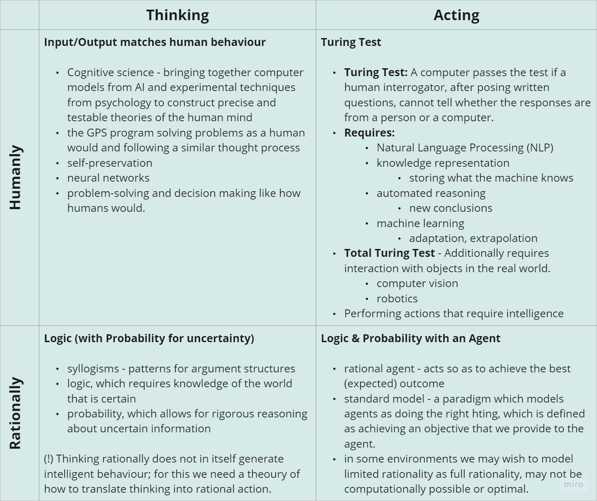
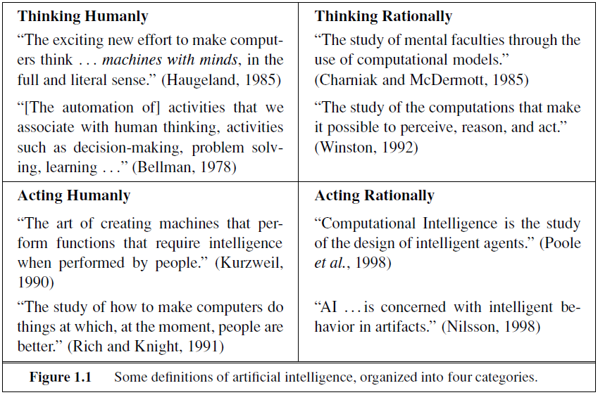

# Week 1 - Introduction to Artificial Intelligence

<h2>Reading for this week</h2>

## Required Reading

### Lesson 1

Section 1.1 of Artificial Intelligence: A Modern Approach

### Lesson 2

Section 1.3, 1.4 and 1.5 of Artificial Intelligence: A Modern Approach

### Lesson 3

Section 3.1 of Artificial Intelligence: A Modern Approach

### Lesson 4

Section 7.1 of Artificial Intelligence: A Modern Approach

### Lesson 5

Section 19.1 of Artificial Intelligence: A Modern Approach

### Lesson 6

Article 1 - [Drones will soon decide who to kill](https://eu.alma.exlibrisgroup.com/leganto/public/44YORK_INST/citation/36793454880001381?auth=SAML)

Article 2 - [The everyday ethical challenges of self-driving cars](https://eu.alma.exlibrisgroup.com/leganto/public/44YORK_INST/citation/36793453910001381?auth=SAML)

Article 3 - [Mastering the game of Go with deep neural networks and tree search](https://eu.alma.exlibrisgroup.com/leganto/public/44YORK_INST/citation/36793445570001381?auth=SAML)

## Optional Reading

The following are recommended reading to provide some more background for the essay part of the first practical assessment:

[Self-Driving Cars](https://theconversation.com/will-self-driving-cars-reduce-energy-use-and-make-travel-better-for-the-environment-55363)

[The Trolley Problem](https://theconversation.com/the-trolley-dilemma-would-you-kill-one-person-to-save-five-57111)

[AI Has Yet to Create a Doomsday Machine](https://theconversation.com/no-need-to-panic-artificial-intelligence-has-yet-to-create-a-doomsday-machine-35148) (Which is reassuring I guess)

[The Environmental Impact of ChatGPT](https://earth.org/environmental-impact-chatgpt/)

## What is AI (Artificial Intelligence)?

Above, you see two images, matrices that describe 8 different definitions of Artificial Intelligence. They are:

- **Thinking Humanly**
- **Thinking Rationally**
- **Acting Humanly**
- **Acting Rationally**

### Acting Humanly: The Turing Test Approach

Posited by Turing in 1950, the **Turing Test** is passed if a response from a computer to a specific set of questions is indistinguishable from a human's. For example, if a computer is asked "What's the weather like?" and they respond with "it's warm and a little sunny, but not quite comfortable enough for jeans and a t-shirt", they would likely pass the Turing Test.

Chapter 26 of the core text goes into this topic a little deeper and questions whether a machine that passes the test is truly intelligent, but that's another topic for another time.

The requirements of a machine to be able to do this are:

- Natural Language Processing
- Knowledge Representation
  - Storage of knowledge
- Automated Reasoning
  - Using stored knowledge to reach new conclusions
- Machine Learning
  - Adapt to new circumstances and extrapolate to detect patterns

#### Total Turing Test

The so-called **Total Turing Test** measures a machine's ability to interact humanly with the world around it, just as a creature with senses would. To that end, a totally Turing passing machine usually involves

- Computer Vision
- Robotics

Since the 50s when this test was first developed, it should be noted that much AI research does not occur with the intention to pass a machine as human. Instead, they aim *not* to create an imitation of a human, but instead aim to understand the underlying principles that govern what it means to be intelligent. The same way the Wright brothers stopped looking to imitate birds, but studied aerodynamics instead.

### Thinking Humanly: Cognitive Modelling Approach

This is a weirder one, I think. Thinking is an inherently self-referential and meta theory. We're thinking about thinking. In the 60s, Newell and Simon created a **General Problem Solver** (GPS) that could solve problems accurately. They weren't happy with just having a solver - they wanted to *compare the traces of reasoning with that of humans* completing the same problem. "Can a computer think the way a human thinks?" is the principle question at work here.

Enter **Cognitive Science**. This is the art of bridging the gap between artificial intelligence and psychology. Well, *in silico* cognitive science is. This is where we apply the testable theories of human/animal psychology to machine learning and AI models.

Cognitive science in psychology and AI fuel the research of one another, albeit with one benefitting more than the other.

### Thinking Rationally: The Laws of Thought

This school of thought was born of Aristotle. **Rational thinking** is supposedly what governed the human mind, seeing logical steps between information and conclusions. For example, Aristotle said "Socrates is a man; all men are mortal; therefore Socrates is mortal". Correct conclusions were always assuming correct premises. These are his *syllogisms*.

19th Century logicians developed a system that notates the relationships between any objects, like an arithmetic that extends past numbers. By 1965, there were machines that could be used to find a solution to any problem given a set of facts written in logical arithmetic.

### Acting Rationally: The Rational Agent

**Agents** are things that act. That's all. In a sense, any computer is an agent since it does things. However, the definition of 'agent' we use extends this to mean any object that acts *autonomously*. A **rational agent** is an agent that aims to reach a goal in the best possible way (or in the case of non-deterministic systems, the best probable way).

This approach includes and extends the rational thinking approach - after all, you need to be able to think rationally to act rationally. However, rational inference is not all that is required to make rational decisions. After all, if a person were to think about their response to touching a hot pan, they would end up with deeper burns than if they just reacted.

A rational agent also has components of the [Turing Test](#acting-humanly-the-turing-test-approach). Knowledge representation and automated reasoning allow a computer to make use of the information it has stored. A rational agent also needs to make use of natural language processing in order to get by in a complex society that is driven by language. It also needs to learn in order to generate *effective* behaviour.

Rational action has two main advantages over the other approaches. It is more generalised than the laws of thought approach - it extends these principles into action, and also goes beyond simple inference. It is also easier to measure than the Turing Test approach - rationality is a mathematically defined principle that is generalisable to extend past the realm of human thinking. Humans are adapted to thrive in specific environments (like the wild and, now, the sofa), while a machine can be taught to behave rationally in any environment.
