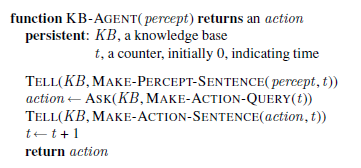

# Week 1 - Introduction to Artificial Intelligence

<h2>Reading for this week</h2>

## Required Reading

### Lesson 1

Section 1.1 of Artificial Intelligence: A Modern Approach

### Lesson 2

Section 1.3, 1.4 and 1.5 of Artificial Intelligence: A Modern Approach

### Lesson 3

Section 3.1 of Artificial Intelligence: A Modern Approach

### Lesson 4

Section 7.1 of Artificial Intelligence: A Modern Approach

### Lesson 5

Section 19.1 of Artificial Intelligence: A Modern Approach

### Lesson 6

Article 1 - [Drones will soon decide who to kill](https://eu.alma.exlibrisgroup.com/leganto/public/44YORK_INST/citation/36793454880001381?auth=SAML)

Article 2 - [The everyday ethical challenges of self-driving cars](https://eu.alma.exlibrisgroup.com/leganto/public/44YORK_INST/citation/36793453910001381?auth=SAML)

Article 3 - [Mastering the game of Go with deep neural networks and tree search](https://eu.alma.exlibrisgroup.com/leganto/public/44YORK_INST/citation/36793445570001381?auth=SAML)

## Optional Reading

The following are recommended reading to provide some more background for the essay part of the first practical assessment:

[Self-Driving Cars](https://theconversation.com/will-self-driving-cars-reduce-energy-use-and-make-travel-better-for-the-environment-55363)

[The Trolley Problem](https://theconversation.com/the-trolley-dilemma-would-you-kill-one-person-to-save-five-57111)

[AI Has Yet to Create a Doomsday Machine](https://theconversation.com/no-need-to-panic-artificial-intelligence-has-yet-to-create-a-doomsday-machine-35148) (Which is reassuring I guess)

[The Environmental Impact of ChatGPT](https://earth.org/environmental-impact-chatgpt/)

## What is AI (Artificial Intelligence)?

Above, you see two images, matrices that describe 8 different definitions of Artificial Intelligence. They are:

- **Thinking Humanly**
- **Thinking Rationally**
- **Acting Humanly**
- **Acting Rationally**

### Acting Humanly: The Turing Test Approach

Posited by Turing in 1950, the **Turing Test** is passed if a response from a computer to a specific set of questions is indistinguishable from a human's. For example, if a computer is asked "What's the weather like?" and they respond with "it's warm and a little sunny, but not quite comfortable enough for jeans and a t-shirt", they would likely pass the Turing Test.

Chapter 26 of the core text goes into this topic a little deeper and questions whether a machine that passes the test is truly intelligent, but that's another topic for another time.

The requirements of a machine to be able to do this are:

- Natural Language Processing
- Knowledge Representation
  - Storage of knowledge
- Automated Reasoning
  - Using stored knowledge to reach new conclusions
- Machine Learning
  - Adapt to new circumstances and extrapolate to detect patterns

#### Total Turing Test

The so-called **Total Turing Test** measures a machine's ability to interact humanly with the world around it, just as a creature with senses would. To that end, a totally Turing passing machine usually involves

- Computer Vision
- Robotics

Since the 50s when this test was first developed, it should be noted that much AI research does not occur with the intention to pass a machine as human. Instead, they aim *not* to create an imitation of a human, but instead aim to understand the underlying principles that govern what it means to be intelligent. The same way the Wright brothers stopped looking to imitate birds, but studied aerodynamics instead.

### Thinking Humanly: Cognitive Modelling Approach

This is a weirder one, I think. Thinking is an inherently self-referential and meta theory. We're thinking about thinking. In the 60s, Newell and Simon created a **General Problem Solver** (GPS) that could solve problems accurately. They weren't happy with just having a solver - they wanted to *compare the traces of reasoning with that of humans* completing the same problem. "Can a computer think the way a human thinks?" is the principle question at work here.

Enter **Cognitive Science**. This is the art of bridging the gap between artificial intelligence and psychology. Well, *in silico* cognitive science is. This is where we apply the testable theories of human/animal psychology to machine learning and AI models.

Cognitive science in psychology and AI fuel the research of one another, albeit with one benefitting more than the other.

### Thinking Rationally: The Laws of Thought

This school of thought was born of Aristotle. **Rational thinking** is supposedly what governed the human mind, seeing logical steps between information and conclusions. For example, Aristotle said "Socrates is a man; all men are mortal; therefore Socrates is mortal". Correct conclusions were always assuming correct premises. These are his *syllogisms*.

19th Century logicians developed a system that notates the relationships between any objects, like an arithmetic that extends past numbers. By 1965, there were machines that could be used to find a solution to any problem given a set of facts written in logical arithmetic.

### Acting Rationally: The Rational Agent

**Agents** are things that act. That's all. In a sense, any computer is an agent since it does things. However, the definition of 'agent' we use extends this to mean any object that acts *autonomously*. A **rational agent** is an agent that aims to reach a goal in the best possible way (or in the case of non-deterministic systems, the best probable way).

This approach includes and extends the rational thinking approach - after all, you need to be able to think rationally to act rationally. However, rational inference is not all that is required to make rational decisions. After all, if a person were to think about their response to touching a hot pan, they would end up with deeper burns than if they just reacted.

A rational agent also has components of the [Turing Test](#acting-humanly-the-turing-test-approach). Knowledge representation and automated reasoning allow a computer to make use of the information it has stored. A rational agent also needs to make use of natural language processing in order to get by in a complex society that is driven by language. It also needs to learn in order to generate *effective* behaviour.

Rational action has two main advantages over the other approaches. It is more generalised than the laws of thought approach - it extends these principles into action, and also goes beyond simple inference. It is also easier to measure than the Turing Test approach - rationality is a mathematically defined principle that is generalisable to extend past the realm of human thinking. Humans are adapted to thrive in specific environments (like the wild and, now, the sofa), while a machine can be taught to behave rationally in any environment.

### Which Paradigm?

The all-important question that we need to answer from this is: how do we want to use AI? Should AI be as close an imitation to human activity and thinking as possible? Or should all AI be rational, emotionless thinkers of only logic?

It depends on the situation. Of course. You may want a human-like AI in the home to respond to your questions and produce actions that are rudimentally just like your own. You'd also want an AI that can reliably solve the trolley problem like a human would. In driverless cars, sometimes the best decision (as infrequent as it may be) is to hit a tree and more likely kill a driver than to hit a child and kill the child (also incurring penalties like jail time and fines).

On the other hand, the most rational AI would be able to provide step by step plans on how to survive in the wild, or how to model any creature's best survival tactics in a harsh environment. The options are limitless if we generalise past the realms of human imitation.

## The State of the Art in AI

Let me begin this section by saying I'm going to be talking about the history of AI, the state of modern AI, and how they compare and relate to the four definitions of AI.

### The History of AI

In 1943, [McCulloch and Pitts](https://link.springer.com/article/10.1007/BF02478259) produced the first work that is recognised as contributing to AI developments. They coined the concept of a neural network, mimicking the nerual network of the brain to show how any computation can be accomplished with a network. Each 'neuron' represented the "factual equivalent of a proposition which proposed its adequate stimulus". Using this model, they also suggested that a computer could *learn*.

In 1949, [Hebb](https://pure.mpg.de/rest/items/item_2346268_3/component/file_2346267/content) proposed a model for how learning could take place based on neuronal synapses strengthening and weakening. Though Hebb was a psychologist, it was found that this model could also be used in machine learning neural networks. In 1950, two undergraduate students of Harvard created a neural network using 3000 vacuum tubes to simulate 40 neurons. One of these students was Marvin Minsky, renowned as the father of AI.

#### Summer Camp

In 1956, another influential figure of AI development, John McCarthy, invited 10 interested researchers to Dartmouth College (now the birthplace of AI) to research how "every aspect of learning ... can be so precisely described that a machine can be made to simulate it".

This wasn't necessarily an important workshop in the sense that no new ground was broken, but the major players in the field were introduced to one another, leading to greater advances in the field.

Two of the attendees, Newell and Simon, had already created a reasoning program that was capable of "thinking non-numerically".

We can also see, at this point, that the separate field of Aritificial Intelligence needed to be given its own name because no other, similar fields like control theory, decision theory and operations research aimed to duplicate human faculties. These faculties include things like creativity, self-improvement and language use.

AI also has a different **methodology**, placing heavy emphasis on the application to computers and the need to build autonomously intelligent machines that could function in any environment.

#### The Rise and Fall of a Midwestern AI Chatbot

From 1952 to 1969, many advancements were made. Most notably are:

| Who?             | When?     | What?                      | Where?                                                                                                                         |
|------------------|-----------|----------------------------|--------------------------------------------------------------------------------------------------------------------------------|
| Newell and Simon | 1957      | General Problem Solver     | [here](http://bitsavers.informatik.uni-stuttgart.de/pdf/rand/ipl/P-1584_Report_On_A_General_Problem-Solving_Program_Feb59.pdf) |
| Newell and Simon | 1976      | Physical Symbol Hypothesis | [here](https://dl.acm.org/doi/10.1145/360018.360022)                                                                           |
| Gelernter        | 1959      | Geometry Theorem Prover    | [here](https://dl.acm.org/doi/10.1145/1460361.1460381)                                                                         |
| Samuel           | 1952-1956 | Draughts Game Machine      | [here](https://ieeexplore.ieee.org/document/5389202)                                                                           |
| McCarthy         | 1958      | Lisp Programming Language  | [here](https://www-formal.stanford.edu/jmc/recursive.pdf)                                                                      |
| McCarthy         | 1958      | Advice Taker               | [*Programs with Common Sense*](https://www-formal.stanford.edu/jmc/mcc59.pdf)                                                  |
| Robinson         | 1965      | Resolution Model           | [here](https://dl.acm.org/doi/pdf/10.1145/321250.321253)                                                                       |
| Shakey Robotics  | 1965-1972 | Shakey the Robot           | [here](https://exhibits.stanford.edu/ai/catalog/tt618qz3245)                                                                   |

This takes us all the way from general problem solving (thinking humanly) through machine gaming, all the way to integration of computer vision, cybernetics and machine learning to produce SHAKEY the robot - sweet guy.

After this, it became apparent that AI research was slowing down. It almost ground to a halt in some places, with the UK government shutting down all but 2 universities' funding for an AI lab. There are 3 main accredited reasons for this:

1. Most programs knew nothing of their subject matter - they weren't trained in the field that they were being used in
2. Scaling up became infeasible since computational complexity hadn't been theorised
    1. They really thought that scaling to larger **microworlds** just needed more memory and faster processors
3. While simple neural networks (**perceptrons**) could learn anything they could represent, what they could represent was very limited.

These and other points were elucidated in the [Lighthill report](https://www.chilton-computing.org.uk/inf/literature/reports/lighthill_report/p001.htm) (1973) that led to funding for AI being withdrawn.

#### A Resurgence: Domain Expansion

The first of the above problems is easiest to solve: background information and context. The first program designed to overcome this was [`DENDRAL`](https://ntrs.nasa.gov/api/citations/19660004785/downloads/19660004785.pdf). Technically 2 distinct programs (Meta-DENDRAL and Heuristic DENDRAL), DENDRAL was used to determine the chemical structure of a substance given the chemical formula and the mass spectrogram of said chemical. In the instance of a naive program, one would find all possible chemical structures of the formula, then find the mass spectrometry results that best matched the experimental result. This is obviously not good for any chemical more complex than methane due to combinatorial explosiveness. The key is domain knowledge.

When the developers of DENDRAL asked analytical chemists how they usually go about identifying a chemical from a mass spectrogram, they responded by saying to look for common structures that are indicative of substructures. For example, a ketone group (C=O) is found at m=28. If we find that there is a ketone, the number of molecules that the formula could allude to is dramatically reduced (yay! No more combinatorial explosion!).

This revelation resulted in the development of a series of similar programs that were used in other fields. These were developed by the Heuristic Program Projects (HPP). Firstly was `MYCIN`. This was used to diagnose blood infections using a set of about 450 rules. However, because the knowledge behind diagnoses did not come from a general theoretical model, it had to be acquired from experts in the field and their experiences and textbooks. A calculus of uncertainty was included known as **certainty factors** was developed to mimic an expert's decision uncertainty.

Another program called `SHRDLU` (I know, try saying that 3 times) was used in the development of intelligent natural language processing.

> Quick aside for Minsky's *microworlds*. Marvin Minsky's path diverged from McCarthy's not long after he moved to MIT in 1958. He was obsessed with finding provably useful, logical solutions to artificial intelligence. To this end, he and some students of his developed programs that could provably find solutions to any problems set out in little microcosms - specific environments in which an AI could carry out its little tasks
>
> These became known as **microworlds**. One such was the block world - one in which objects were easily identifiable objects. These objects could be physical, or they could be more hypothetical. It is in this world that `SHRDLU` thrived.

This was good, but not quite golden. When linguist-turned-AI-researcher Roger Schank claimed that "there is no such thing as syntax", he upset his old colleagues, but lit a fire under his new friends. It became apparent that AI's interpretation of natural language processing had little to do with the rules of language ([thinking rationally](#thinking-rationally-the-laws-of-thought)), but had more to do with representing and reasoning with knowledge required to understand language ([thinking humanly](#thinking-humanly-cognitive-modelling-approach)).

#### The Era of Nostalgia: the 80s

When the 80s came around, a series of other revolutions occurred. Here they are:

- 1980 - AI becomes an industry
- 1986 - back-propagation heralds the return of neural networks
- 1987 - AI adopts the scientific method
- 1995 - Emergence of intelligent agents
- 2001 - Very large data sets

Okay, so this is more than the 80s but still. Important rise in stuff production.

### What Can AI do Today?

Here's a list of AI things we do now:

- Driverless vehicles
  - DARPA challenge 2006 saw the creation of Stanley, the robotic car. He won the race with an average speed of 22mph through the Mojave desert. Neat.
- Speech Recognition
- Autonomous Planning and Scheduling
- Games!
- Spam fighting
- Logistics
- Robotics
  - Check out Boston Dynamics, they're cool for this sort of stuff.
- Machine Language Translation
  - Yes, technically Google Translate is an application of AI!

## AI Search Algorithms

We're going to talk about one specific kind of goal-based agents: **problem-solving agents**

These are inherently different from **reflex agents** described in chapter 2 (but not here), which base their actions on a direct mapping of states to actions. Goal-based agents consider the future and the consequences of each of their actions to determine how desirable a decision is.

Problem-solving agents use atomic representations to model the world around them - states are available to the agent as a whole, with any underlying concepts or details abstracted away. Think, for example, we as humans think about a pen, a desk, or a megaceros as objects - as a whole. We don't, however, think about them as a collection of fundamental physical particles described purely mathematically. These objects are our **atomic representations**.

### The Scenario

> A holiday-maker is chilling in Arad, Romania. They have a non-refundable flight booked tomorrow morning that leaves from Bucharest, a city they are not in at the moment. Obviously. This holiday-maker (agent) needs to make their way to Bucharest by 9:00 tomorrow. Best of luck, Agent!

### Problem-Solving Agents

What are **goals**? Well, aside from the things I make for myself and rarely achieve, they can be considered a *set of **world states***. In a very simple situation, let's say you want to get from Arad to point Bucharest. If getting an agent to Bucharest is the goal, we can say that the coordinates of the agent must be equal to the coordinates of Bucharest. That is the goal. The set of world states is $$X_{Agent} = X_{Goal}\\ Y_{Agent}=Y_{Goal}$$

The first stage of getting to a goal is **goal formulation** In real life, this is also the first step. If you want to reach your goals, you must set out some tangible goals first.

The next stage is **problem formulation**. This is a process  that considers what level of atomicity is required in taking actions, as well as which actions to *consider* to get to the goal. More on this [later]

Our agent would like to get to Bucharest from Arad. There are three major roads leading out of Arad, that lead to Sibiu, Timisoara and Zerind - none of which are Bucharest. As far as the agent is concerned, it's screwed unless it knows its way around Romania. Which it doesn't. The environment is *unknown* (See section 2.3.2 for definitions of task environment properties like this). Unfortunately, the only real course of action is to take a route at random. This situation is covered [later].

Let's assume the poor sod *does* know its way around Romania - it has a map. The purpose of a map is to give an agent an idea of what it can do given different states. Some of these states will include things like outgoing routes for different cities, name of the next city and location of the next city. In general, an agent with several immediate options of unknown value can decide what to do by first examining future actions that eventually lead to states of known value. *It can get from point A to point B via unknown states by using a map to make decisions*.

Aside from **known**, we can say list other properties of this task environment:

- Observable
  - The state of the task environment is always knowable to the agent
- Discrete
  - There are a finite number of decisions to be made at any point
- Known
  - A map suffices to bridge the gap between known and unknown
- Deterministic
  - Each action has exactly one outcome

> Quickly, I'd like to define a **percept**. This is a thing that an agent has observed - they have perceived it. This is not necessarily the same thing as the state of the environment the agent is in, it depends on how they *perceive* the state.

### Problems

How do we define a problem then? A problem typically consists of 5 components:

1. Initial state of the agent
    1. For our case, this could be `In(Arad)`
2. A description of possible actions for the agent
    1. This is a set of actions like `{Go(Zerind), Go(Sibiu), Go(Timisoara)}`
3. A description of what each action does - the **transition model**
    1. Follows the form `Result(state, action) = state`.
    2. For example, `Result(In(Arad), Go(Zerind)) = In(Zerind)`
4. The goal test.
    1. A check to see if the state of the environment meets the conditions of the goal(s)
    2. In the example, the goal set is the singleton set `{In(Bucharest)}`
5. A path cost function
    1. Used to determine the cost of each path, allowing the agent to make numerically 'good' decisions about routes to take.

A path is the line drawn between two points on a graph. A graph? Yes! A graph! The graph in this case is called the **state space**, and it is the collective term for components 1-3 above.

The above map is not necessarily the state space in graph form, but it is a human-legible representation of the path costs between cities in this portion of Romania.

**Abstraction** is a large part of searching for an acceptable solution to a problem. In this example, the states and actions are abstracted as well as the conditions along the way. For example, the roads may be full of potholes, or there could be a lot of speed cameras, or roadworks ahead (I sure hope it does!); or we could get into infinite details of the actions - 'turn the wheel one degree clockwise' is far too much detail when we just want to get to the next city.

A solution is successfully abstracted if we can expand the abstracted solution into a more detailed solution without requiring any additional states.

#### Further Reading

Take a look at section 3.2 of the core text. There are some interesting **Toy problems** and **real-world problems** there.

## Logic Solvers

These seem really dumb at first. Take for example, Alice and the rain. We know three things: If someone goes out in the rain, they get wet; Alice went outside; it is raining. We can see easily using our vast human capacity for inference that Alice will get wet. We call that commone sense. Computers do not have common sense. They are not *intelligent* (roll credits).

So, how can we develop **reasoning** in computers (technical term for sense, common or otherwise)? The agents from the previous section know things, but very inflexibly - they can learn about the environment by being given information, but they can't *generate* their own information. Enter **Knowledge-Based Agents**

### Knowledge-Based Agents

The central component of a knowledge-based agent is its **Knowledge Base (KB)**. Duh. This is essentially a set of **sentences** written in a **knowledge representation language** (KRL), similar in nomenclature and nature to sentences in natural languages. When a sentence is given without being derived from other sentences, it is called an **axiom** - more or less a fact about the world.

So how do these work?

In principle, a KB agent works with its KB to update itself in response to percepts from its environment. It does this using a `TELL` and `ASK` command. Both operations may involved inference, but when something is `ASK`ed of the KB, the answer should be something that follows from what the KB has already been `TELL`ed (told). Step by step, what happens when the agent is called is:

1. The KB is `TELL`ed what the agent perceives
2. It `ASK`s the KB what action should be performed next
    1. This is where most of the reasoning fits in
3. The agent `TELL`s the KB which action was chosen and performs it.

A very simple pseudocode implementation looks like this:

A KB agent can be built simply by telling it what it needs to know about its environment and its goals. Two approaches are recognised for building the initial knowledge base: declarative and procedural. In the declarative sense, each sentence is `TELL`ed to the KB one by one, and in the procedural approach, initial sentences are directly encoded into the knowledge bases. Apparently there's lots of fighting between camps but like, they're not that different?

We can also get the agent to learn for itself. Chapter 18 goes into this in more detail apparently. This whole section is about learning so yeah, makes sense. That's actually the next lesson now:

## Machine Learning

Machine learning typically needs little introduction. It's what comes to mind when someone says "AI is going to take your jobs!". It's really capable of so many things and is based on the concept of learning from information to generate new information that can be used to inform itself or us.

Generally, machine learning takes 3 forms:

- Unsupervised Learning
  - The agent isn't given any explicit feedback, but learns to generate new information about its percepts to achieve a goal.
  - One well-known method of this is cluster analysis. A big part of unsupervised learning is about patterns
- Reinforcement Learning
  - Think Pavlov's dog. You're training a computer with positive and negative feedback based on their actions
  - The aim of the AI is not to achieve a distinct goal, but to produce actions that lead to high levels of positive association with actions.
  - Say your aim is to win a match of chess. The AI's aim is to avoid bad moves, and to make good moves
- Supervised Learning
  - Here, the agent is given a series of input-output pairs and the aim is to learn a function that maps one to the other consistently.
  - This function can be a simple association function between variables, or a set of actions based on percepts like whether there is a bus in front of a car.

The lines between these three definitions can be a little blurry at times, which isn't great but allows for some diversity in things like **semi-supervised** learning. If you take pictures of people and ask them their ages, then train an agent on those data, this is supervised learning. If, however, some of the people lied about their ages, it becomes an unsupervised learning problem to ascertain the true ages of these individuals.

> There is a whole load of AI-driven game videos out there. I just watched one that uses reinforcement learning to come up with the best strategies for Monopoly, only to find that it plays about as well as any person does.
>
> AI Warehouse does some fun little experiments with an agent call Albert; and some other accounts use reinforcement learning on things like Trackmania and Mario games. Not seeing many examples of games that people use supervised or unsupervised learning for.
>
> - Supervised learning is often used to train models on existing gameplay data, mimicking human players.
> - Unsupervised learning is utilized for clustering, anomaly detection, and strategy discovery without labeled data.
> - Reinforcement learning dominates in real-time and strategy games where self-play and exploration are key.
