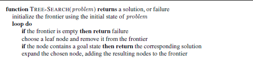
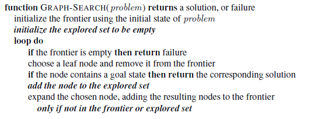
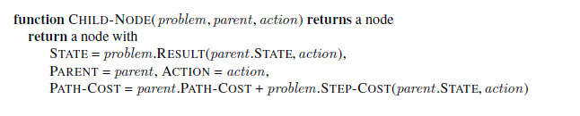

# Week 2 - Solving Problems with Search - Uninformed Search Strategies

<details><summary><h2>Reading for this week</h2></summary>

## Required Reading

### Lesson 1

Section 3.1 and 3.2 of Artificial Intelligence: A Modern Approach

### Lesson 2

Section 3.3 of Artificial Intelligence: A Modern Approach

### Lesson 3

Section 3.4.1 of Artificial Intelligence: A Modern Approach

Section 3.4.4 of Artificial Intelligence: A Modern Approach

Section 3.4.5 of Artificial Intelligence: A Modern Approach

Section 3.4.7 of Artificial Intelligence: A Modern Approach

## Optional Reading

[Google Go 1](https://theconversation.com/googles-go-triumph-is-a-milestone-for-artificial-intelligence-research-53762)

[Google Go 2](https://theconversation.com/googles-go-victory-shows-ai-thinking-can-be-unpredictable-and-thats-a-concern-56209)
</details>

## Contents

1. [Representation of AI Search Problems](#representation-of-ai-search-problems)
    1. [The Definition of a Problem](#the-definition-of-a-problem)
    2. [Toy Problems](#toy-problems)
    3. [A Quick Activity](#a-quick-activity)
2. [Tree and Graph Searches](#tree-and-graph-searches)
    1. [Structure of a Tree](#structure-of-a-tree)
    2. [Measuring Problem-Solving Performance](#measuring-problem-solving-performance)

## Representation of AI Search Problems

So, we actually covered a lot of this in [week 1](../Week%201%20-%20Introduction%20to%20Artificial%20Intelligence%20-%20uniformed%20search%20strategies/README.md#problems). I'll write a little more about it here though.

### The Definition of a Problem

Problems are easy to put into words. We each have at least 99 of them and we can describe them using our words - "I don't have a good job", "I want to be hired", etc. However, a computer doesn't read that all too well. So we have to structure our problems that we want solving in a certain way:

> Using the [scenario](../Week%201%20-%20Introduction%20to%20Artificial%20Intelligence%20-%20uniformed%20search%20strategies/README.md#the-scenario) laid out in the previous week

1. Initial state of the agent
    1. For our case, this could be `In(Arad)`
2. A description of possible actions for the agent
    1. This is a set of actions like `{Go(Zerind), Go(Sibiu), Go(Timisoara)}`
3. A description of what each action does - the **transition model**
    1. Follows the form `Result(state, action) = state`.
    2. For example, `Result(In(Arad), Go(Zerind)) = In(Zerind)`
4. The goal test.
    1. A check to see if the state of the environment meets the conditions of the goal(s)
    2. In the example, the goal set is the singleton set `{In(Bucharest)}`
5. A path cost function
    1. Used to determine the cost of each path, allowing the agent to make numerically 'good' decisions about routes to take.
    2. Each step has a cost too.

The following is pseudocode representation of a problem-solving agent:

```bash
function SIMPLE-PROBLEM-SOLVING-AGENT(percept) # returns an action
    persistent: seq # an action sequence, initially empty
                state # some description of the current world state
                goal # a goal, initially null
                problem # a problem formulation
    
    state ← UPDATE-STATE(state, percept)
    if seq is empty then
        goal ← FORMULATE-GOAL(state)
        problem ← FORMULATE-PROBLEM(state, goal)
        seq ← SEARCH(problem)
    if seq = failure then return a null action

    action ← FIRST(seq)
    seq ← REST(seq)
    return action
```

Now that I'm really reading it, that's genuinely the most barebones thing I've ever seen. It does, however, put it more eloquently than I could with words.

We don't have the exact data structure for a sequence here, nor a goal or problem but anyway, the main point I bring to you now is that components 1-3 of the list above constitute the **state space** (initial state, actions, transition model) of the problem.

### Toy Problems

I now present 4 **toy problems** - problems that don't have much real-world significance, but serve to prove a point or solve a game puzzle.

#### Vacuum World


It's not a big world - only two tiles - but a world nonetheless. In this world, there is a vacuum and there is dirt. The goal of any good vacuum is to clean dirt from the floor. The vacuum, presumably turned on, is able to move left or right, or suck. From these three actions (any of which is possible from any position), there arise 8 states. Two of these states are goal states (there is no dirt). The problem can be formulated a bit better as follows:

- States
  - State is determined by agent and dirt locations, resulting in 8 possible permutations.
  - An area with $n$ tiles has $n\cdot2^n$ states
- Initial State
  - Any State
- Actions
  - Left, Right, Suck
  - In a more complex environment, Up and Down may be permitted
- Transition Model
  - Named actions do as expected, except Left in leftmost, Right in rightmost and Suck in clean tiles do nothing
- Goal Test
  - Checks that all tiles are clean
- Path Cost
  - Each step costs 1, so the path cost is the number of steps taken

#### The 8-Puzzle


Next is the 8-puzzle. I had one of these as a kid that had a picture of Bumblebee from Transformers on it. I never solved it.

This is a simple game, you move tiles around to get from the random start state to the goal state (there are others, just so long as the empty tile doesn't interrupt the order).

In contrast to the vacuum world toy problem, this one has over 100,000 states. This is why I couldn't solve it as a kid. I was also thinking about it wrong. A computer will look at this puzzle from the perspective of the blank tile, rather than the 8 tiles around it.

The problem formulation for this is:

- States
  - 8 tiles placed in the 3x3 grid with an empty space left
- Initial state
  - Any one of the $9!$ permutations
- Actions
  - Movement of the blank space Left, Right, Up, or Down
- Transition Model
  - Choosing an action results in a new state, swapping the position of a tile with the blank space
- Path Cost
  - Same as before, each step costs 1 so the path cost is the number of steps.

The family of sliding-block puzzles in known to be NP-complete. NP is a class of problems for which there is an algorithm that can *validate* a solution to the problem in *polynomial time* $(O(n^k))$. A proble is NP-hard if it is at least as hard to verify a candidate solution as any other NP problem. An NP-complete problem is an NP-hard problem that also belongs to NP (i.e. a candidate solution can be verified in polynomial time).

> If you've heard of NP, you've heard of the million-dollar question: Does P equal NP? What does that mean? Well, while NP (Nondeterministic polynomial) classifies problems that can be *validated* in polynomial time, P (polynomial) problems can be *solved* from scratch in polynomial time. It then follows that, if any NP-complete problem is solved in polynomial time, P = NP. This hasn't been done so far - there are no algorithms that solve NP-hard problems in polynomial time as of yet.

#### The 8 Queens Problem


The goal of this puzzle is to place 8 queens on a regular 8x8 chess board such that no queen can take another. There are exactly 92 solutions to this problem, one being in the image above. This is a useful test problem for search algorithms.

There are two main formulations of this problem: the **incremental formulation** and the **complete-state formulation**:

- In general, an incremental formulation is one that involves operators that augment the state description.
  - For us, the state description changes from "64 empty tiles in an 8x8 grid" to "63 empty tiles with a queen placed in one, in an 8x8 grid"
  - In this case, this means each action adds a queen
- In general, a complete-state formulation starts with an end-state and the operators change the state only, rather than the state description.
  - In this case, that means starting with all 8 queens randomly arranged on the board and moving them until a solution is found.

The incremental formulation of this problem may initially look like:

- States
  - Any arrangement of 0 to 8 queens on the board is a state
- Initial State
  - No queens on the board
- Actions
  - Add a queen to an empty tile
- Transition Model
  - Returns board with queen added to square
- Goal Test
  - 8 queens on the board, none in danger

This formulation creates a huge state space of $\prod_{n=57}^{64}n \approx 1.8\times10^{14}$. That's 180 quadrillion. Yikes. An alternative to this is to only add queens where they cannot be attacked. This actually reduces the state space all the way down to 2057. The states and actions for this are:

- States
  - All arrangements of queens $(0\le n\le 8)$, one per column in the leftmost $n$ columns.
- Actions
  - Add a queen to any square in the leftmost empty column such that it is not attacked by a queen

This is a drastic reduction, particularly in the case of the 100-queens problem with a 100x100 grid ($10^400$ down to $10^52$). However, this reduction is still not enough. See section 4.1 and chapter 6 for complete-state formulation and a simple solving algorithm.

#### Knuth's Problem

David Knuth devised a problem that illustrates how an infinite state space can arise. He posits that any integer can be generated from the number 4 using only square root, factorial and floor operations. The following is a good example:

$$
\lfloor\sqrt{\sqrt{\sqrt{\sqrt{\sqrt{(4!)!}}}}}\rfloor=5
$$

The thing that makes this an infinite state problem is that there are numbers generated along the way that can be countably infinite. $(4!)!$ generates the value $620,448,401,733,239,439,360,000$ along the way. That's 620 sextillion. Large.

That's a defined route - essentially we're going `4 → factorial → factorial → square root → square root → square root → square root → square root → floor`

### A Quick Activity


Peg Solitaire is a game played by one person. The rules of the game are laid out on [Wikipedia](https://en.wikipedia.org/wiki/Peg_solitaire). I'm going to try and create an AI search problem formulation based on those rules.

- States
  - Pegs placed on board within range $1\le n\le 32$ where n is the number of pegs
- Initial State
  - 32 pegs arranged on board with 33 tiles, center tile is empty
- Actions
  - Any peg can move orthogonally into a space (left, right, up, down) if there is a peg followed by a space in chosen direction
- Transition Model
  - Chosen peg moves 2 tiles in chosen direction; overleapt peg is removed from board
- Goal Test
  - 1 peg remains on the board in any location

This is an incremental formulation of the search problem. I can't really think of a complete-state formulation since the goal state is any of the 33 arrangements where a single peg is on the board.

## Tree and Graph Searches

When searching for a solution to a problem, the states of that problem should be stored in a useful data structure. It's been a little while (I last really looked at them in the ADS module), but trees and graphs are data structures that can hold states in such a way that any state is navigable. Navigating these data structures is how a search algorithm is implemented.

However, it's a slightly different thing in the sense that the entire tree is not held in memory at any one time. The tree is generated at runtime, with each node being **expanded** into. Expanding a node, in this case, means applying every possible action to the current node to generate the next set of nodes. The leaf nodes that can be expanded are known as the **frontier** of the search tree.

Expanding nodes uses a simple algorithm, named here as `TREE-SEARCH`:



All tree search algorithms have this as a base. The main point of difference is how the next node is chosen (the **search strategy**). In many cases, the search algorithm has every opportunity to go back on itself if a previously visited node is found in the frontier. This creates what is called a **loopy path**. Kinda informal, but this is a path belonging to the more general **redundant path** set. If you're going to consider a loopy path in a search algorithm, it's possible for the complete search tree to be *infinite* - even if there is a better route, you may end up in limbo. Path redundancy occurs whenever there is more than one path to get to a state - whichever is objectively worse is redundant.

Placing constraints on the problems themselves can often prevent this from happening. For example, in the 8-queens problem, we only allow the incremental queen to be placed in the leftmost empty column, reducing the number of paths to a state with n queens from n! to just 1 - there is only one path to 2 queens if they're all placed in the leftmost column, but two if they can be anywhere (as long as the chess board grows with n).

In cases where the actions are reversible (e.g. you can go back to Arad from Sibiu), redundancy is unavoidable. Route-finding on a rectangular grid is a tricky problem especially in computer games. It means that each node has 4 children, so a search tree with depth $d$ has a size of $4^d$. However, for each node, there are only about $2d^2$ *distinct* nodes within $d$ steps of it. Note how that is "about", because if $d$ is one, that would mean that only 2 of its children are distinct, which isn't true.

> Algorithms that don't learn from their history are doomed to repeat it

A very topical sentence to read at this time in global history :/

The way to avoid redundancy in these instances is to introduce a data structure that stores the visited nodes - the **explored set**. Newly generated nodes that match those found in the explored set are not visited again (i.e. removed from the frontier for this iteration). The algorithm for the general `GRAPH-SEARCH` is shown here:



Since this algorithm's data structure contains only one copy of each state, we can visualise it like an actual graph (hence the name). What's also nice is that the frontier here separates the explored and unexplored regions.

### Structure of a Tree

Trees are kind of abstract concepts compared to the nodes that comprise them. Nodes in themselves can be trees so we define a node rather than the tree containing it.

Typically, a node comprises 4 properties that are stored:

1. Parent
2. State
3. Action
4. Path Cost

The children of a node are not actually stored by the node since they are generated by the actions from states, which prevents the entire data structure being stored in memory at one time. Consider the following algorithm an initialisation function for a node object:



It's important to note at this point that **a node is not a state**, but a node stores a state. A node is just a bookkeeping data structure - two nodes can contain the same state, but have different paths from the **root node**.

Now that we have the data structure for a node, we need somewhere to put them. We store the frontier nodes in their own data structure. We choose a general queue for this purpose. Queues can be implemented in different ways, typically FIFO (standard queue), LIFO (stack) or with a specified priority ordering (priority queue). These are specified by different implementations of the `POP` operation of a queue.

We also need an explored set so that we remove redundancy from the algorithm. This is often done using a hash table of some sort so as to keep insertion and lookup to a constant time complexity.

Speaking of time complexity, how do we measure the effectiveness of a search algorithm?

### Measuring Problem-Solving Performance

There are four main ways of measuring the performance of an algorithm:

- Completeness
- Optimality
- Time complexity
- Space complexity

Space and time complexities are measured slightly differently in AI, since the graph is generated at runtime and the depth is not pre-determined like in other graph route-finding problems. As such, they are expressed differently. Instead of the number of vertices and edges ($\lvert V \rvert + \lvert E \rvert$), the terms $b$, $d$ and $m$ are used:

- $b$
  - The branching factor
  - Maximum number of successors of any node
- $d$
  - Depth of the *shallowest* goal node
- $m$
  - The maximum length of any branch in the state space
  - Not the maximum depth of the tree as this could be infinite

Time complexity is measured as the number of nodes generated along the way to a goal, and space complexity is the number of nodes held in memory at any one time (the frontier + the explored set $\lvert F \rvert + \lvert X \rvert$)

## Uninformed Search Strategies

These are more or less graph traversal problems with a goal. If we look at the pseudocode for either tree or graph search, you'll see we need to choose a node to explore next. **Breadth-first**, **Depth-first** and **Iterative Deepening** search are methods that dictate how the next node is chosen. In short:

- Breadth-first search uses a FIFO queue to choose the next node of the frontier
- Depth-first search uses a LIFO queue (stack)
  - Depth-limited search is a derivative of this that treats nodes at depth $l$ (for limit) as terminal nodes - those that have no successors
  - Iterative Deepening is also a derivative of this. The limit is incremented so as to find goals that are no deeper than the shallowest goal.

These are called uninformed search strategies because the algorithm does not inherently know how close it is to any goal. In order to inform the algorithm, a **heuristic** function is required. This is covered next week I believe

First up, breadth-first search

### Breadth-First Search

```pseudo
function BREADTH-FIRST-SEARCH(problem) returns a solution, or failure
  node ← a node with STATE = problem.INITIAL-STATE, PATH-COST = 0
  if problem.GOAL-TEST(node.STATE) then return SOLUTION(node)
  frontier ← a FIFO queue with node as the only element
  explored ← an empty set
  loop do
    if EMPTY?(frontier) then return failure
    node ← POP(frontier) # chooses the shallowest node in frontier
    add node.STATE to explored
    for each action in problem.ACTIONS(node.STATE) do
      child ← CHILD-NODE(problem, node, action)
      if child.STATE is not in explored or frontier then
        if problem.GOAL-TEST(child.STATE) then return SOLUTION(child)
        frontier ← INSERT(child, frontier)
```

The algorithm above is the pseudocode for the breadth-first search, which I'll be attempting to implement in Java later (or Python if I'm allowed).

Note that this is a specialisation of the `GRAPH-SEARCH` algorithm from above, with one minor tweak - the goal test is run when the node is generated rather than when it is selected for expansion (except for the root node which is tested upon initialisation).

#### BFS Performance

In terms of completeness, BFS is guaranteed to find a path to the goal state as long as the goal is at finite depth $d$. Furthermore, the path to the goal is also guaranteed to be the shallowest solution. This doesn't, however, mean that the solution is the most optimal. In the case that the step cost is a non-decreasing function of the depth, the shallowest solution is in fact the most optimal. For every other case, the shallowest is not the most optimal.

In terms of complexities, the story is not so great. Imagine a tree with a branching factor, $b$ such that every node has $b$ successors (easiest with $b=2$). At $d=1$, the number of *generated* nodes is $b$, at $d=2$, it is $b + b^2$, at $d=3$, it is $b + b^2 + b^3$. What that is to say is that the number of generated nodes for a tree with branching factor $b$ and depth $d$ is $\sum_{n=1}^db^n$ which simplifies in terms of complexity to $O(b^d)$ which is not great at all.

Could be worse, though. If we were to check for the goal test at selection for expansion, this would become $O(b^{d+1})$ as the whole succeeding layer would be generated first.

As for space complexity, the nodes are stored in both the frontier and explored sets. For BFS, the explored set has $O(b^{d-1})$ nodes, and the frontier has $O(b^d)$ nodes, reducing the space complexity to $O(b^d)$, the same as the time complexity.

#### Uniform Cost Search

Earlier I said that BFS is optimal under the assumption that the cost function is non-decreasing with respect to depth. But what if it is? BFS stops being optimal. There's something we can do about this: priority queues!

If we order the `POP`ing of nodes in our frontier queue based on the expected path cost of the next node, given by the path cost function $g(n)$. The algorithm is a little different in that the goal test is checked at selection rather than generation, and a test is added in case a better path is found to a node currently on the frontier. What this means is that, even if the goal state is found using a shallow path, the algorithm continues until there are no other paths to the goal with a lower cost, even if they are at a greater depth.

In terms of complexities, the uniform cost search is difficult to express in terms of depth, since the depth of the goal can be multiple values. Instead, we use $C^*$ to denote the path cost of the optimal and $\epsilon$ to denote the smallest step cost. The worst case for both space and time complexity is $O(b^{1+\lfloor C^*/\epsilon\rfloor})$ which is, at best, equivalent to $O(b^{d+1})$

### Depth-First Search

There are two main versions of this algorithm, dependent on whether you're using a graph representation or tree representation. The choice is actually very significant.

Depth-first uses a LIFO queue (stack) to expand the deepest node first. By default, the graph-search version of this is complete - it will expand every node in the graph at some point. However, the tree version is not - you will likely run into infinite loops like Arad-Sibiu-Arad-Sibiu if you're not careful. By careful, I mean checking to see if the next state is already in the path at no extra memory cost. In an infinite state space, however, both algorithms will fail if a non-goal path is found (like Knuth's 4 problem - it will just keep doing factorial forever).

Both options are also non-optimal. If a goal node is found at a greater depth than another goal node that is just the last child of the root, then that deeper goal will be returned as the solution. As such, the complexity of this algorithm is $O(b^m)$, where $m$ is oftentimes much greater than the depth of the optimal goal solution. It can even be infinite if the tree is unbounded.

So, DFS is not optimal, is only reliable in finite state spaces and has an astronomical worst-case time complexity. Why bother?

Space complexity.

BFS has an abhorrent space complexity of $O(b^d)$ (not as bad as DFS time complexity). However, DFS doesn't need anywhere near that much memory. When diving into a subtree, only the path that is being recursed is stored in memory, along with the sibling nodes of the topmost level. This means that the number of nodes generated and stored is at most $O(bm)$, which is *linear*. As such, depth-first tree search is much preferred in the field of AI, since the maximum depth of a tree can get pretty large. Like, imagine a route-finding algorithm that has really fine scale details, down to the square meter. If you want to get from Plymouth to Exeter (73.5km), you'd have a seriously deep tree to navigate that would actually have very few branches. May bring complexity close to $O(m)$ in practice.
