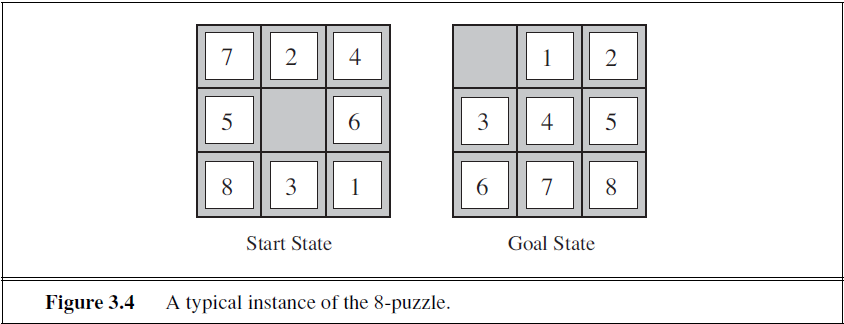

# Week 2 - Solving Problems with Search - Uninformed Search Strategies

<details><summary><h2>Reading for this week</h2></summary>

## Required Reading

### Lesson 1

Section 3.1 and 3.2 of Artificial Intelligence: A Modern Approach

### Lesson 2

Section 3.3 of Artificial Intelligence: A Modern Approach

### Lesson 3

Section 3.4.1 of Artificial Intelligence: A Modern Approach

Section 3.4.4 of Artificial Intelligence: A Modern Approach

Section 3.4.5 of Artificial Intelligence: A Modern Approach

Section 3.4.7 of Artificial Intelligence: A Modern Approach

## Optional Reading

[Google Go 1](https://theconversation.com/googles-go-triumph-is-a-milestone-for-artificial-intelligence-research-53762)

[Google Go 2](https://theconversation.com/googles-go-victory-shows-ai-thinking-can-be-unpredictable-and-thats-a-concern-56209)
</details>

## Representation of AI Search Problems

So, we actually covered a lot of this in [week 1](../Week%201%20-%20Introduction%20to%20Artificial%20Intelligence%20-%20uniformed%20search%20strategies/README.md#problems). I'll write a little more about it here though.

### The Definition of a Problem

Problems are easy to put into words. We each have at least 99 of them and we can describe them using our words - "I don't have a good job", "I want to be hired", etc. However, a computer doesn't read that all too well. So we have to structure our problems that we want solving in a certain way:

> Using the [scenario](../Week%201%20-%20Introduction%20to%20Artificial%20Intelligence%20-%20uniformed%20search%20strategies/README.md#the-scenario) laid out in the previous week

1. Initial state of the agent
    1. For our case, this could be `In(Arad)`
2. A description of possible actions for the agent
    1. This is a set of actions like `{Go(Zerind), Go(Sibiu), Go(Timisoara)}`
3. A description of what each action does - the **transition model**
    1. Follows the form `Result(state, action) = state`.
    2. For example, `Result(In(Arad), Go(Zerind)) = In(Zerind)`
4. The goal test.
    1. A check to see if the state of the environment meets the conditions of the goal(s)
    2. In the example, the goal set is the singleton set `{In(Bucharest)}`
5. A path cost function
    1. Used to determine the cost of each path, allowing the agent to make numerically 'good' decisions about routes to take.
    2. Each step has a cost too.

The following is pseudocode representation of a problem-solving agent:

```bash
function SIMPLE-PROBLEM-SOLVING-AGENT(percept) # returns an action
    persistent: seq # an action sequence, initially empty
                state # some description of the current world state
                goal # a goal, initially null
                problem # a problem formulation
    
    state ← UPDATE-STATE(state, percept)
    if seq is empty then
        goal ← FORMULATE-GOAL(state)
        problem ← FORMULATE-PROBLEM(state, goal)
        seq ← SEARCH(problem)
    if seq = failure then return a null action

    action ← FIRST(seq)
    seq ← REST(seq)
    return action
```

Now that I'm really reading it, that's genuinely the most barebones thing I've ever seen. It does, however, put it more eloquently than I could with words.

We don't have the exact data structure for a sequence here, nor a goal or problem but anyway, the main point I bring to you now is that components 1-3 of the list above constitute the **state space** (initial state, actions, transition model) of the problem.

### Toy Problems

I now present 4 **toy problems** - problems that don't have much real-world significance, but serve to prove a point or solve a game puzzle.

#### Vacuum World


It's not a big world - only two tiles - but a world nonetheless. In this world, there is a vacuum and there is dirt. The goal of any good vacuum is to clean dirt from the floor. The vacuum, presumably turned on, is able to move left or right, or suck. From these three actions (any of which is possible from any position), there arise 8 states. Two of these states are goal states (there is no dirt). The problem can be formulated a bit better as follows:

- States
  - State is determined by agent and dirt locations, resulting in 8 possible permutations.
  - An area with $n$ tiles has $n\cdot2^n$ states
- Initial State
  - Any State
- Actions
  - Left, Right, Suck
  - In a more complex environment, Up and Down may be permitted
- Transition Model
  - Named actions do as expected, except Left in leftmost, Right in rightmost and Suck in clean tiles do nothing
- Goal Test
  - Checks that all tiles are clean
- Path Cost
  - Each step costs 1, so the path cost is the number of steps taken

#### The 8-Puzzle



Next is the 8-puzzle. I had one of these as a kid that had a picture of Bumblebee from Transformers on it. I never solved it.

This is a simple game, you move tiles around to get from the random start state to the goal state (there are others, just so long as the empty tile doesn't interrupt the order).

In contrast to the vacuum world toy problem, this one has over 100,000 states. This is why I couldn't solve it as a kid. I was also thinking about it wrong. A computer will look at this puzzle from the perspective of the blank tile, rather than the 8 tiles around it.

The problem formulation for this is:

- States
  - 8 tiles placed in the 3x3 grid with an empty space left
- Initial state
  - Any one of the $9!$ permutations
- Actions
  - Movement of the blank space Left, Right, Up, or Down
- Transition Model
  - Choosing an action results in a new state, swapping the position of a tile with the blank space
- Path Cost
  - Same as before, each step costs 1 so the path cost is the number of steps.

The family of sliding-block puzzles in known to be NP-complete. NP is a class of problems for which there is an algorithm that can *validate* a solution to the problem in *polynomial time* $(O(n^k))$. A proble is NP-hard if it is at least as hard to verify a candidate solution as any other NP problem. An NP-complete problem is an NP-hard problem that also belongs to NP (i.e. a candidate solution can be verified in polynomial time).

> If you've heard of NP, you've heard of the million-dollar question: Does P equal NP? What does that mean? Well, while NP (Nondeterministic polynomial) classifies problems that can be *validated* in polynomial time, P (polynomial) problems can be *solved* from scratch in polynomial time. It then follows that, if any NP-complete problem is solved in polynomial time, P = NP. This hasn't been done so far - there are no algorithms that solve NP-hard problems in polynomial time as of yet.

#### The 8 Queens Problem


The goal of this puzzle is to place 8 queens on a regular 8x8 chess board such that no queen can take another. There are exactly 92 solutions to this problem, one being in the image above. This is a useful test problem for search algorithms.

There are two main formulations of this problem: the **incremental formulation** and the **complete-state formulation**:

- In general, an incremental formulation is one that involves operators that augment the state description.
  - For us, the state description changes from "64 empty tiles in an 8x8 grid" to "63 empty tiles with a queen placed in one, in an 8x8 grid"
  - In this case, this means each action adds a queen
- In general, a complete-state formulation starts with an end-state and the operators change the state only, rather than the state description.
  - In this case, that means starting with all 8 queens randomly arranged on the board and moving them until a solution is found.

The incremental formulation of this problem may initially look like:

- States
  - Any arrangement of 0 to 8 queens on the board is a state
- Initial State
  - No queens on the board
- Actions
  - Add a queen to an empty tile
- Transition Model
  - Returns board with queen added to square
- Goal Test
  - 8 queens on the board, none in danger

This formulation creates a huge state space of $\prod_{n=57}^{64}n \approx 1.8\times10^{14}$. That's 180 quadrillion. Yikes. An alternative to this is to only add queens where they cannot be attacked. This actually reduces the state space all the way down to 2057. The states and actions for this are:

- States
  - All arrangements of queens $(0\le n\le 8)$, one per column in the leftmost $n$ columns.
- Actions
  - Add a queen to any square in the leftmost empty column such that it is not attacked by a queen

This is a drastic reduction, particularly in the case of the 100-queens problem with a 100x100 grid ($10^400$ down to $10^52$). However, this reduction is still not enough. See section 4.1 and chapter 6 for complete-state formulation and a simple solving algorithm.

#### Knuth's Problem

David Knuth devised a problem that illustrates how an infinite state space can arise. He posits that any integer can be generated from the number 4 using only square root, factorial and floor operations. The following is a good example:

$$
\lfloor\sqrt{\sqrt{\sqrt{\sqrt{\sqrt{(4!)!}}}}}\rfloor=5
$$

The thing that makes this an infinite state problem is that there are numbers generated along the way that can be countably infinite. $(4!)!$ generates the value $620,448,401,733,239,439,360,000$ along the way. That's 620 sextillion. Large.

That's a defined route - essentially we're going `4 → factorial → factorial → square root → square root → square root → square root → square root → floor`

### A Quick Activity


Peg Solitaire is a game played by one person. The rules of the game are laid out on [Wikipedia](https://en.wikipedia.org/wiki/Peg_solitaire). I'm going to try and create an AI search problem formulation based on those rules.

- States
  - Pegs placed on board within range $1\le n\le 32$ where n is the number of pegs
- Initial State
  - 32 pegs arranged on board with 33 tiles, center tile is empty
- Actions
  - Any peg can move orthogonally into a space (left, right, up, down) if there is a peg followed by a space in chosen direction
- Transition Model
  - Chosen peg moves 2 tiles in chosen direction; overleapt peg is removed from board
- Goal Test
  - 1 peg remains on the board in any location

This is an incremental formulation of the search problem. I can't really think of a complete-state formulation since the goal state is any of the 33 arrangements where a single peg is on the board.
