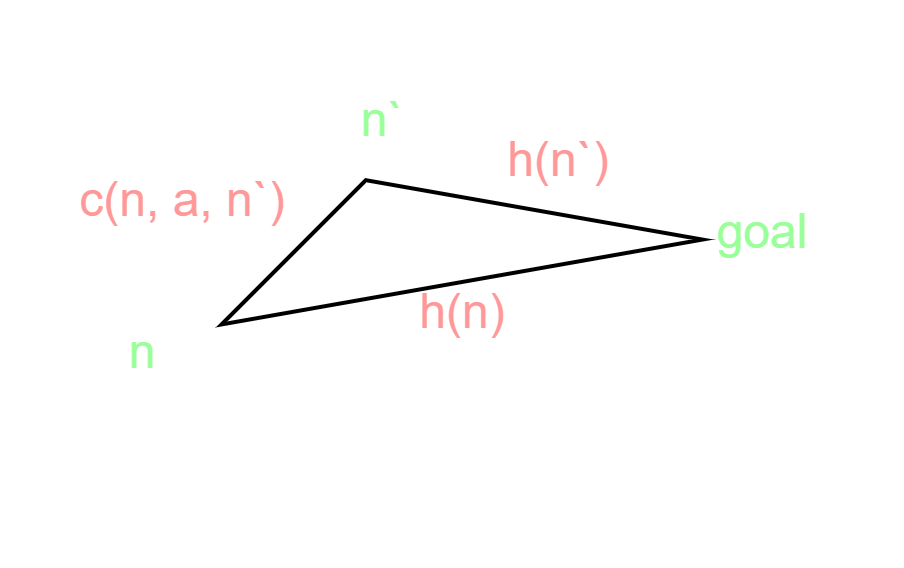

# Week 3 - Solving Problems with Search - Informed Search Strategies

<h2>Reading for this Week</h2>

## Required Reading

### Lesson 1

Section 3.5 of Artificial Intelligence: A Modern Approach

Section 3.5.1 of Artificial Intelligence: A Modern Approach

Section 3.5.2 of Artificial Intelligence: A Modern Approach

### Lesson 2

Section 3.6 of Artificial Intelligence: A Modern Approach

Section 3.6.1 of Artificial Intelligence: A Modern Approach

Section 3.6.2 of Artificial Intelligence: A Modern Approach

## Optional Reading

Chapter 3, Section 3.5.3 of Artificial Intelligence: A Modern Approach

[Monte Carlo Tree Search](https://www.youtube.com/watch?v=lhFXKNyA0QA) used in DeepMind's AlphaGo

I think this week is going to be interesting. I want to look at all the different techniques I can find.

## Informed Search Strategies

Last week we looked at search strategies that just aimed to find the goal state(s) blindly. They did this without any real knowledge of the problem, meaning the algorithm would normally take them down any route by guessing. **Informed search strategies** are, however, more informed about their goal states. One typical method of informing our algorithms of how well they're doing is to introduce a **heuristic** - a value that represents how close the agent is to their goal.

We'll be looking mainly at two types of ISS this week - greedy best first search and the A* algorithm.

### Heuristic Functions

In informed strategies, a heuristic informs the agent of their distance from a goal. This distance is determined by using a heuristic function $h(n)$ which is a component of the evaluation function $f(n)$ used for evaluating the next node to expand. In the instance of breadth- and depth-first search, $f(n)$ is represented by the order of the removal of elements in the frontier - `pop()` is $f(n)$. Our implementation of `pop()` from our frontier is what determines the nature of the search algorithm.

Introducing a subroutine $h(n)$ affords us greater control over how nodes in the frontier are chosen.

### Greedy Best-First Search

This family of algorithms is relatively simple. It expands the node that is closest to the goal such that the evaluation function is equal to the heuristic function ($f(n)=h(n)$).

For many instances, $h(n)$ is calculated as the **straight line distance** (SLD) to the goal. This can be calculated using any distance measure, but typically and most simply, **Manhattan distance**. Also known as taxi cab distance, Manhattan is a straight line measure that is the sum of the absolute differences between the start and end points. Slightly different to Euclidean distance since it acts like it's on a grid. Good for solving grid-mazes. In the case of our [scenario](../Week%201%20-%20Introduction%20to%20Artificial%20Intelligence%20-%20uniformed%20search%20strategies/README.md#the-scenario), the distance is typically calculated using the **Euclidean distance** between a node and its goal.

This algorithm is good - in this case, it will never expand a node that is not on the path to a solution. However, it is not optimal - there are routes that, although the SLD to the goal is longer at a given node, the overall route cost is lower. This may mean moving further away from the goal to find a shorter route.

When the cost of an action is not taken into account, the algorithm is **greedy** - at each node, it only chooses the next node that gets it closer to the goal. It is also incomplete in the tree form, even in finite state spaces. Take going from Iasi to Fagaras as a problem, the heuristic says to expand Neamt, which is a dead end. Neamt chooses Iasi, which expands to Neamt, then back to Iasi. This algorithm will never reach the goal from this starting point.

The space and time complexities for the graph form of this algorithm are both $O(b^m)$ which isn't great because $m$ is the maximum depth of the state space.

#### Dijkstra's Algorithm

**Dijkstra's algorithm** is an instance of greedy best-first search that, just like GBFS, makes **locally optimal** decisions about node expansion. The main distinction here is that Dijkstra ensures these choices are **globally optimal** by keeping track of cumulative costs. It's actually probably more accurate to call it a [Uniform Cost Search](../Week%202%20-%20Solving%20Problems%20with%20Search%20-%20uninformed%20search%20strategies/README.md#uniform-cost-search). This is because, instead of using the heuristic function, it *only* uses the path cost function $g(n)$. So, while it is an instance of GBFS, it is also an instance of UCS that is specialised for graphs with non-negative costs. Maybe I should've put this in the last week.

### A* Algorithm

The A* algorithm improves on the GBFS algorithm's incompleteness and greed by taking inspiration from Dijkstra's algorithm; it uses the path cost function to maintain global optimality. The search function becomes: $$f(n)=g(n)+h(n)$$ This essentially translates to "the estimated cost of the shortest path through node $n$". Under certain conditions of the heuristic function, this algorithm is complete and optimal.

What conditions are needed for optimality? I'll tell you.

Firstly, the heuristic must be **admissible**, meaning it can *never* overestimate the distance to the goal. In the case of Euclidean distance (and any other good distance metric), the calculated distance can never be greater than the actual optimal path. if you draw a straight line from A to B, the distance through other nodes can never be shorter. This is all to say that the heuristic is **optimistic**.

The second condition, at least for A*, is **consistency**. That is, for any node, its heuristic must be *no greater than* the step cost of reaching its successor, plus the heuristic of that successor:

$$h(n)\le c(n, a, n^\prime)+h(n^\prime)$$

This is a form of the **triangle inequality**, which stipulates that each side of a triangle can be no longer than the sum of the other two sides.

Consistency is typically a stricter requirement than admissibility since every consistent function is also admissible.

#### Optimality of A*

> The tree search form of A\* is optimal if $h(n)$ is *admissible*, while the graph form of A* is optimal if $h(n)$ is *consistent*.

Let's kind of prove the optimality of the A* algorithm.

We have a few steps to cover:

1. If the heuristic is consistent, then the values of $f(n)$ along any path are non-decreasing
2. When the algorithm selects a node for expansion, the optimal path to that successor has been found

The first one follows from the triangle inequality. Suppose a successor $n^\prime$ of node $n$; then $g(n^\prime)=g(n)+c(n,a,n^\prime)$ for some action $a$:

$$f(n^\prime)=g(n^\prime)+h(n^\prime)=g(n)+c(n,a,n^\prime)+h(n^\prime)\ge g(n)+h(n)=f(n)$$

Which basically says "the cost of getting to a successor is always at least the cost of its parent".

For the second proof, we use the graph separation property that arises from the nondecreasing property. If the path to the successor was not optimal, the value of $f(n)$ would be greater than that of $f(n^\prime)$, violating the first property.

It then follows that the first goal node selected for expansion is on an optimal solution path since $f$ is the true cost of a goal node (since $h=0$ for them). Any later goal node is therefore at least as expensive.

It also follows that A\* expands all nodes where $f(n)<C^*$ where $C^*$ is the cost of the optimal soution. A* may also expand nodes that have a cost that is equal to that of the goal, before finding the goal.

#### The Problem with A*

So, with this in mind, you'd probably assume that A\* is the answer to all our problems. It's true that it is complete and will always find the optimal solution with **optimal efficiency**; however, the number of states that are not pruned (i.e. included in the search space) is still exponential.

<h5>Errors of Heuristics</h5>

For problems with constant step costs, the growth in runtime as a function of optimal goal depth $d$ is analysed in terms of **absolute and relative error** of the heuristic $h$. Absolute error is defined as $\Delta\equiv h^*-h$ where $h^*$ is the actual cost from root to goal, while relative error is defined as $\epsilon\equiv\frac{\Delta}{h^*}$

For simple problems with a single goal that are a tree with reversible actions (8-puzzle comes to mind), the time complexity of A* is exponential with respect to maximum absolute error, $\Delta$ ($O(b^\Delta)$). This can be represented as $O(b^{\epsilon d})$ for constant step costs

When the state space has many goal states - particularly near-optimal goals - search can be led away from any one optimal path. Each goal state seems to act like a gravitational attractor. This introduces an extra cost proportional to the number of goal states within a factor of $\epsilon$ of the optimal cost. All of the above has been in the case of tree implementations. With a graph it gets worse.

There can be exponentially many states with $f(n)<C^*$ in a graph, even if error is constantly bounded. In the case of the vacuum problem, modified such that the agent can clean a tile without having to visit it first (i.e. we just suck any location, no left or right actions), there are still $2^N$ states that are all on an optimal solution path, even if the absolute error is bounded to 1.

On top of all this, A* is a recursive algorithm that keeps all generated nodes in memory, leading to more memory issues than time issues for larger problem spaces.
