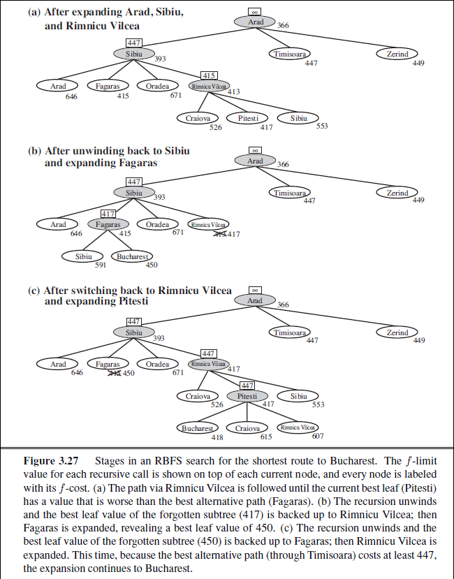

# Week 3 - Solving Problems with Search - Informed Search Strategies

<h2>Reading for this Week</h2>

## Required Reading

### Lesson 1

Section 3.5 of Artificial Intelligence: A Modern Approach

Section 3.5.1 of Artificial Intelligence: A Modern Approach

Section 3.5.2 of Artificial Intelligence: A Modern Approach

### Lesson 2

Section 3.6 of Artificial Intelligence: A Modern Approach

Section 3.6.1 of Artificial Intelligence: A Modern Approach

Section 3.6.2 of Artificial Intelligence: A Modern Approach

## Optional Reading

Chapter 3, Section 3.5.3 of Artificial Intelligence: A Modern Approach

[Monte Carlo Tree Search](https://www.youtube.com/watch?v=lhFXKNyA0QA) used in DeepMind's AlphaGo

I think this week is going to be interesting. I want to look at all the different techniques I can find.

## Informed Search Strategies

Last week we looked at search strategies that just aimed to find the goal state(s) blindly. They did this without any real knowledge of the problem, meaning the algorithm would normally take them down any route by guessing. **Informed search strategies** are, however, more informed about their goal states. One typical method of informing our algorithms of how well they're doing is to introduce a **heuristic** - a value that represents how close the agent is to their goal.

We'll be looking mainly at two types of ISS this week - greedy best first search and the A* algorithm.

### What are Heuristic Functions?

In informed strategies, a heuristic informs the agent of their distance from a goal. This distance is determined by using a heuristic function $h(n)$ which is a component of the evaluation function $f(n)$ used for evaluating the next node to expand. In the instance of breadth- and depth-first search, $f(n)$ is represented by the order of the removal of elements in the frontier - `pop()` is $f(n)$. Our implementation of `pop()` from our frontier is what determines the nature of the search algorithm.

Introducing a subroutine $h(n)$ affords us greater control over how nodes in the frontier are chosen.

### Greedy Best-First Search

This family of algorithms is relatively simple. It expands the node that is closest to the goal such that the evaluation function is equal to the heuristic function ($f(n)=h(n)$).

For many instances, $h(n)$ is calculated as the **straight line distance** (SLD) to the goal. This can be calculated using any distance measure, but typically and most simply, **Manhattan distance**. Also known as taxi cab distance, Manhattan is a straight line measure that is the sum of the absolute differences between the start and end points. Slightly different to Euclidean distance since it acts like it's on a grid. Good for solving grid-mazes. In the case of our [scenario](../Week%201%20-%20Introduction%20to%20Artificial%20Intelligence%20-%20uniformed%20search%20strategies/README.md#the-scenario), the distance is typically calculated using the **Euclidean distance** between a node and its goal.

This algorithm is good - in this case, it will never expand a node that is not on the path to a solution. However, it is not optimal - there are routes that, although the SLD to the goal is longer at a given node, the overall route cost is lower. This may mean moving further away from the goal to find a shorter route.

When the cost of an action is not taken into account, the algorithm is **greedy** - at each node, it only chooses the next node that gets it closer to the goal. It is also incomplete in the tree form, even in finite state spaces. Take going from Iasi to Fagaras as a problem, the heuristic says to expand Neamt, which is a dead end. Neamt chooses Iasi, which expands to Neamt, then back to Iasi. This algorithm will never reach the goal from this starting point.

The space and time complexities for the graph form of this algorithm are both $O(b^m)$ which isn't great because $m$ is the maximum depth of the state space.

#### Dijkstra's Algorithm

**Dijkstra's algorithm** is an instance of greedy best-first search that, just like GBFS, makes **locally optimal** decisions about node expansion. The main distinction here is that Dijkstra ensures these choices are **globally optimal** by keeping track of cumulative costs. It's actually probably more accurate to call it a [Uniform Cost Search](../Week%202%20-%20Solving%20Problems%20with%20Search%20-%20uninformed%20search%20strategies/README.md#uniform-cost-search). This is because, instead of using the heuristic function, it *only* uses the path cost function $g(n)$. So, while it is an instance of GBFS, it is also an instance of UCS that is specialised for graphs with non-negative costs. Maybe I should've put this in the last week.

### A* Algorithm

The A* algorithm improves on the GBFS algorithm's incompleteness and greed by taking inspiration from Dijkstra's algorithm; it uses the path cost function to maintain global optimality. The search function becomes: $$f(n)=g(n)+h(n)$$ This essentially translates to "the estimated cost of the shortest path through node $n$". Under certain conditions of the heuristic function, this algorithm is complete and optimal.

What conditions are needed for optimality? I'll tell you.

Firstly, the heuristic must be **admissible**, meaning it can *never* overestimate the distance to the goal. In the case of Euclidean distance (and any other good distance metric), the calculated distance can never be greater than the actual optimal path. if you draw a straight line from A to B, the distance through other nodes can never be shorter. This is all to say that the heuristic is **optimistic**.

The second condition, at least for A*, is **consistency**. That is, for any node, its heuristic must be *no greater than* the step cost of reaching its successor, plus the heuristic of that successor:

$$h(n)\le c(n, a, n^\prime)+h(n^\prime)$$

This is a form of the **triangle inequality**, which stipulates that each side of a triangle can be no longer than the sum of the other two sides.

Consistency is typically a stricter requirement than admissibility since every consistent function is also admissible.

#### Optimality of A*

> The tree search form of A\* is optimal if $h(n)$ is *admissible*, while the graph form of A* is optimal if $h(n)$ is *consistent*.

Let's kind of prove the optimality of the A* algorithm.

We have a few steps to cover:

1. If the heuristic is consistent, then the values of $f(n)$ along any path are non-decreasing
2. When the algorithm selects a node for expansion, the optimal path to that successor has been found

The first one follows from the triangle inequality. Suppose a successor $n^\prime$ of node $n$; then $g(n^\prime)=g(n)+c(n,a,n^\prime)$ for some action $a$:

$$f(n^\prime)=g(n^\prime)+h(n^\prime)=g(n)+c(n,a,n^\prime)+h(n^\prime)\ge g(n)+h(n)=f(n)$$

Which basically says "the cost of getting to a successor is always at least the cost of its parent".

For the second proof, we use the graph separation property that arises from the nondecreasing property. If the path to the successor was not optimal, the value of $f(n)$ would be greater than that of $f(n^\prime)$, violating the first property.

It then follows that the first goal node selected for expansion is on an optimal solution path since $f$ is the true cost of a goal node (since $h=0$ for them). Any later goal node is therefore at least as expensive.

It also follows that A\* expands all nodes where $f(n)<C^*$ where $C^*$ is the cost of the optimal soution. A* may also expand nodes that have a cost that is equal to that of the goal, before finding the goal.

#### The Problem with A*

So, with this in mind, you'd probably assume that A\* is the answer to all our problems. It's true that it is complete and will always find the optimal solution with **optimal efficiency**; however, the number of states that are not pruned (i.e. included in the search space) is still exponential.

<h5>Errors of Heuristics</h5>

For problems with constant step costs, the growth in runtime as a function of optimal goal depth $d$ is analysed in terms of **absolute and relative error** of the heuristic $h$. Absolute error is defined as $\Delta\equiv h^*-h$ where $h^*$ is the actual cost from root to goal, while relative error is defined as $\epsilon\equiv\frac{\Delta}{h^*}$

For simple problems with a single goal that are a tree with reversible actions (8-puzzle comes to mind), the time complexity of A* is exponential with respect to maximum absolute error, $\Delta$ ($O(b^\Delta)$). This can be represented as $O(b^{\epsilon d})$ for constant step costs

When the state space has many goal states - particularly near-optimal goals - search can be led away from any one optimal path. Each goal state seems to act like a gravitational attractor. This introduces an extra cost proportional to the number of goal states within a factor of $\epsilon$ of the optimal cost. All of the above has been in the case of tree implementations. With a graph it gets worse.

There can be exponentially many states with $f(n)<C^*$ in a graph, even if error is constantly bounded. In the case of the vacuum problem, modified such that the agent can clean a tile without having to visit it first (i.e. we just suck any location, no left or right actions), there are still $2^N$ states that are all on an optimal solution path, even if the absolute error is bounded to 1.

On top of all this, A* is a recursive algorithm that keeps all generated nodes in memory, leading to more memory issues than time issues for larger problem spaces.

In order to overcome this, there are some algorithms that deal with the space problem without compromising on completeness or optimality.

### Memory-Bounded Heuristic Search

The easiest way to reduce memory requirements is to apply the same concepts as used in iterative deepening - **iterative-deepening A* (IDA*)**. Here, the cutoff is the f-cost, rather than the depth. For each iteration, the cutoff value is the smallest f-cost of any node that exceeded the cutoff on the previous iteration. While this does cut down on the overhead of managing a priority queue, it suffers when dealing with float values (real-value costs).

Other solutions include **recursive best-first search (RBFS)** and **memory-bounded A\* (MA\*)**

#### Recursive Best-First Search

RBFS is a weird one. It tries to captilise on the standard best-first search and reduce the search space to linear. Being recursive, it's similar to that of the depth-first search, but uses an `f_limit` variable to keep track of the next best path available. If the current node exceeds this limit, the recursion unwinds to the alternative path. As it unwinds, the best f-value of the children of that unwound path is stored in each node. This way, RBFS remembers how to get back to the first best route if it decided earlier that it might not be optimal. Very odd, see the image for a better understanding.

The problem with this algorithm, while it can be more efficient than IDA*, is that it suffers from excessive node generation - nodes are generated more often than they're needed to be. I suppose this can be improved using caching, but the issue still stands.

The reason, in general, that the RBFS backtracks at all and seems so uncertain of its choices, is because the heuristic tends to become less optimistic, and more accurate (remember the triangle) as the agent comes closer to the goal.

RBFS is optimal if the heuristic function is admissible (which they ought to be anyway, really). Its space complexity is indeed linear with respect to the *deepest* optimal solution (worst case, $m$) and its time complexity is either $O(b^d)$ or $O(b^d\cdot d)$ in the case that every node results in backtracking. This also applies to DFS due to its recursive nature.

The other downfall of RBFS is that it uses *too little* memory - it forgets the work it has done! This naturally leads to a lot of redundancy in reexpanding nodes it's already visited (and not because it's looping). This may lead to issues associated with redundant paths in graphs.

#### Memory-Bounded A*

This is a clever one. It relies on using the whole memory space allocated to it. However much memory you have, it'll use it. Best applied in huge problems (or if you just have little memory available).

Let's talk about Simplified MA\* (SMA\*). This algorithm proceeds like A\*, but once memory is full of your silly little nodes, the worst one is dropped - the node with the highest f-value is dropped. This value is then backed up to the parent of that forgotten node. What this means is that, if all children of a given node are forgotten, we still have an indication of how worthwhile it is to go anywhere from that node. Useful!

This algorithm is complete if there is any reachable solution within the physical memory of your machine - if $d$ is less than the memory size expressed in nodes. Optimal if any optimal solution is reachable, otherwise returning the best reachable solution. This is a pretty robust choice when the state space is a graph, step costs are *not* uniform, and node generation is expensive.

However, on particularly problematic problems, SMA* will have to switch between candidate solution paths frequently. If this is the case, then most of those candidate paths will not fit in memory, creating a problem not unlike disk thrashing.

## Heuristic Functions

So, with all this in mind, how does one actually create a heuristic function? How do they make a *good* one at that?

### The 8-puzzle

The 8-puzzle, as discussed in week 2, has a much much larger state space than the vacuum problem. This makes it unfeasible to find a solution using uninformed search strategies. So how can we inform it?

Let's create two heuristics, $h_1$ and $h_2$. Let's say:

$$
h_1: \text{the number of misplaced tiles}\\
h_2: \text{the sum of the Manhattan distances}
\\ \text{of each tile to their correct position}
$$

For the state shown in the image above, $h_1=8$ and $h_2=18$. Okay, so which is *better* for us? The average path cost for the 8-puzzle is actually around 26. It's fair to say that $h_2$ is closer than $h_1$ is.

We can characterise the impact of the accuracy of a heuristic in two main ways: **analytically** and **empirically**.

### Analytical Characterisation of the Accuracy of the Heuristic

Lengthy subtitle lol

Analysing the effects of the accuracy of the heuristic comes primarily from the **effective branching factor** $b^*$. To define this, say we have an A* algorithm that expands $N$ nodes in a uniform tree with solution depth $d$. $b^*$ is the number of children each node in this tree would have in order to contain $N+1$ nodes.

$$N+1=1+b^*+(b^*)^2\cdots(b^*)^d$$

It follows that $N+1$ is the sum of a geometric series, which takes the form in this case:

$$N+1=\frac{1-(b^*)^{d+1}}{1-b^*}$$

This can't be numerically rearranged to produce a closed value for $b^*$, but can be estimated using [optimisation techniques](../Programming/Extras/find_b_star.py).

Say, if my A* algorithm finds a solution at depth 5, and uses 52 nodes to get there, the effective branching factor can be estimated to be around 1.92. In practical terms, the closer $b^*$ is to 1, the better.

Each heuristic that is used to guide an agent produces a solution with a given effective branching factor, and it is this value that we use to reflect a heuristic's quality.

This directly reflects the quality of a heuristic because, if we remember the triangle inequality property of a consistent heuristic, the heuristic must be optimistic, and never overestimate the true cost of a step. Following this, the larger a heuristic is (as long as it's still less than the true cost), the better!

### Creating a Heuristic (Frankie says Relax)

One way to create a heuristic is to generate is from a simplified, or **relaxed**, version of the same problem. Relaxation is about loosening the constraints on the problem. Let's look at the 8-puzzle again.

If we relax the constraints such that we can move any tile to its intended position by just swapping it with whatever is already there, we generate $h_1$, the number of misplaced tiles! It only takes that many moves to place all tiles in the correct place. This relaxation is actually not that great as we showed earlier, so let's see about how we can generate $h_2$. This one is generated by only allowing the agent to move one tile at a time.

So, in practice, how is this done?

If we write the 8-puzzle as a problem with formal constraints like *A tile can move from A to B if B is horizontally adjacent and is blank*, we can generate other, relaxed constraints:

1. A can be moved to B if B is horizontally adjacent
2. A can be moved to B if B is blank
3. A can be moved to B

It's important to note that any one of these new sets of constraints can be solved *without* the use of AI search. Otherwise, the heuristic becomes expensive to compute and increases runtime hugely.

$h_1 is derived from the third constraint, while $h_2$ is derived from the first. A third heuristic, we'll name $h_3$, can be derived from the second one. Just from looking at the constraints, we can see that this new heuristic will **dominate** $h_1$ as the contraints are tighter. It will not, however, dominate $h_2$ since it allows any of the 8 tiles to be moved, while $h_2$ only allows about 2.67 to move on average.

It follows that any one of these heuristics is admissible (because the extra edges are between nodes that are further apart) and consistent (since the cost of the heuristic obeys the triangle inequality)

There exists a program called **ABSOLVER** that generates new heuristics from problems. It was used to generate a useful heuristic for solving the rubik's cube, as well as a *better* heuristic for the 8-puzzle.

#### What if we have Many Similar Heuristics

In the case that we have many heuristics where none of them significantly dominate the other, it is possible to create a compund heuristic that essentially chooses whichever heuristic is best when it is called. Since this new heuristic is always at least as good as its constituent parts, it dominates.

$$h(n) = \{h_1(n), h_2(n), \cdots h_m(n)\}$$
