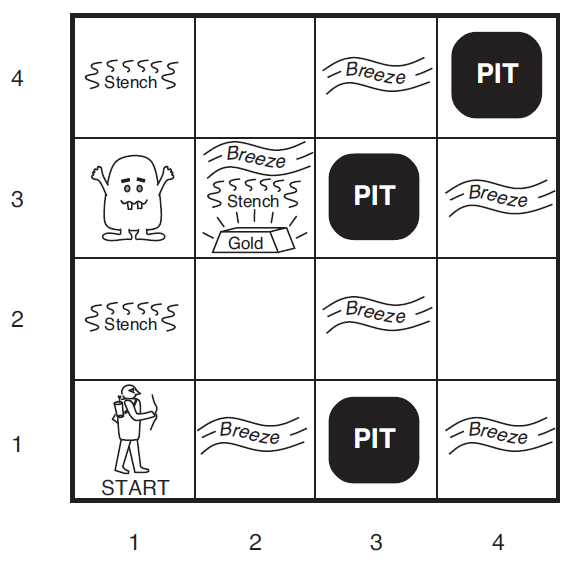
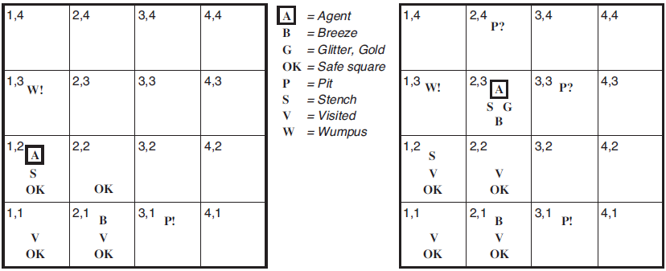
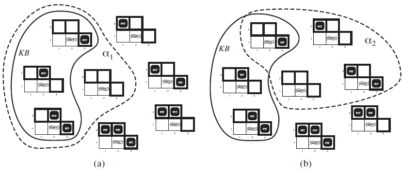
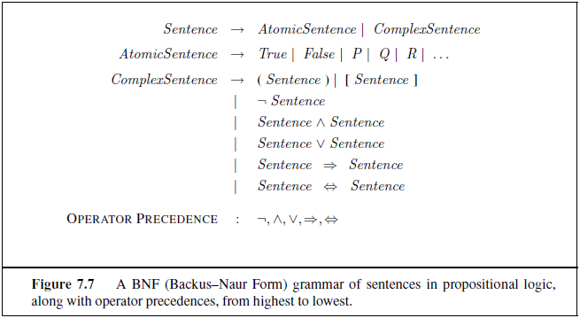
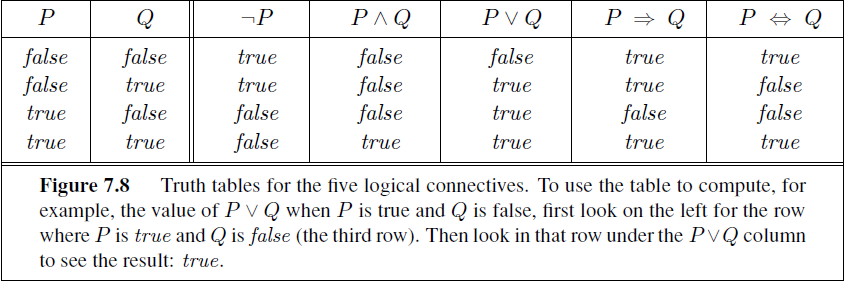

# Week 4 - Representing and Reasoning with Knowledge I

<details><summary><h2>Reading for this week</h2></summary>

## Required Reading

### Lesson 1

Chapter 7, Section 7.2 of Artificial Intelligence: A Modern Approach

Chapter 7, Section 7.3 of Artificial Intelligence: A Modern Approach

Chapter 7, Section 7.4 of Artificial Intelligence: A Modern Approach

### Lesson 2

Chapter 7, Section 7.5.2 of Artificial Intelligence: A Modern Approach

Chapter 7, Section 7.5.3 of Artificial Intelligence: A Modern Approach

Chapter 7, Section 7.5.4 of Artificial Intelligence: A Modern Approach

## Optional Reading

Chapter 8 of Artificial Intelligence: A Modern Approach

This is a whole chapter so only have a look through it. It should be useful in applying first-order logic to different domains. Good for when propositional logic (introduced here) is too large to fit in a computer.

</details>

## Contents

1. [Principles of Logic and Propositional Logic](#principles-of-logic-and-propositional-logic)
    1. [Logical Agent Design (KB Agents)](#logical-agent-design-kb-agents)
    2. [The Wumpus World](#the-wumpus-world)

## Principles of Logic and Propositional Logic

Logic is something we touched on in [week 1](../Week%201%20-%20Introduction%20to%20Artificial%20Intelligence%20-%20uniformed%20search%20strategies/README.md#logic-solvers). The basic concepts that we need to remember from that time are:

- Knowledge bases
  - All the information about a given logical problem is stored in sentences
- Sentences
  - Sentences are written in a knowledge representation language. These are the components of knowledge bases
- Knowledge Reperesentation Language
  - The language that sentences are written in
- Logical Inference
  - The algorithm that is used to infer new information from the knowledge base

Logic takes problem solving agents to the next level. Problem solvers have their deduction logic hard-coded into their transition model functions (I denote this as `neighbours` usually)

### Logical Agent Design (KB Agents)

A knowledge based agent's main component is the **knowledge base (KB)**, comprised of **sentences**, written in a **knowledge representation language**. If a sentence is taken as a given without prior deduction, it is an **axiom**.

In order to add or query a KB, we use the terms `TELL` and `ASK`, both of which may involve **inference**

```pseudo
function KB-AGENT(percept) returns an action
    persistent: KB, a knowledge base
                t, a counter, initially 0, indicating time
    
    TELL(KB, MAKE-PERCEPT-SENTENCE(percept, t))
    action ← ASK(KB, MAKE-ACTION-QUERY(t))
    TELL(KB, MAKE-ACTION-SENTENCE(action, t))
    t ← t + 1
    return action
```

Above is the pseudocode for a simple KB agent. Step by step:

1. The agent is told new information, the percept
2. The KB is queried to find out what action should be performed
    1. This may require extensive reasoning
3. The KB is told which action was taken and the action is returned

Details of the representation language are abstracted within the `MAKE` operations, while the inference mechanisms are found in the `TELL` and `ASK` operations.

A KB agent can be built entirely by `TELL`ing it what it needs to know. It can then build up its own knowledge base until it knows how to operate within the given environment. This is known as **declarative** system building. On the other hand, a **procedural** approach aims to hard-code desired behaviours into the KB as program code. It's helpful to remember that declarative can be used to get the agent to operate in its environment. This can then be translated into a procedural approach since it can be made more efficient.

We can also provide mechanisms that allow for self-learning, covered in chapter 18 (machine learning)

### The Wumpus World



Wumpus (just like the one in Discord) is a monster found in the eponymous **Wumpus World**. This is a small environment that has a wumpus, pits, an agent and a pile of gold in it. You'll find a breeze in tiles adjacent to a pit, and a stench for those adjacent to the wumpus. There is only one wumpus in the world at any one time.

Let's write this out in PEAS structure:

#### Performance Measures

+1000 for climbing out of the cave with the gold, –1000 for falling into a pit or being eaten by the wumpus, –1 for each action taken and –10 for using up the arrow. The game ends either when the agent dies or when the agent climbs out of the cave.

#### Environment

A 4×4 grid of rooms. The agent always starts in the square labeled [1,1], facing to the right. The locations of the gold and the wumpus are chosen randomly, with a uniform distribution, from the squares other than the start square. In addition, each square other than the start can be a pit, with probability 0.2.

#### Actuators

The agent can move Forward, TurnLeft by 90◦, or TurnRight by 90◦. The agent dies a miserable death if it enters a square containing a pit or a live wumpus. (It is safe, albeit smelly, to enter a square with a dead wumpus.) If an agent tries to move forward and bumps into a wall, then the agent does not move. The action Grab can be used to pick up the gold if it is in the same square as the agent. The action Shoot can be used to fire an arrow in a straight line in the direction the agent is facing. The arrow continues until it either hits (and hence kills) the wumpus or hits a wall. The agent has only one arrow, so only the first Shoot action has any effect. Finally, the action Climb can be used to climb out of the cave, but only from square [1,1].

#### Sensors

The agent has five sensors, each of which gives a single bit of information:

- In the square containing the wumpus and in the directly (not diagonally) adjacent squares, the agent will perceive a Stench.
- In the squares directly adjacent to a pit, the agent will perceive a Breeze.
- In the square where the gold is, the agent will perceive a Glitter.
- When an agent walks into a wall, it will perceive a Bump.
- When the wumpus is killed, it emits a Scream that can be perceived anywhere in the cave.

Have a look at the image at the top of this section. You can see what we're getting at here. We can represent this using more concise notation such that:

- A = Agent
- B = Breeze
- G = Glitter
- OK = Safe Square
- P = Pit
- S = Stench
- V = Visited
- W = Wumpus

with modifiers for things we're not certain of (?), and those we become certain of (!).



The thing about some of the logic involved with this is that we must infer information from a *lack* of information (things like "no stench" or "no breeze" meaning the absence of an adjacent wumpus or pit). This is something difficult because our agent currently only responds to precepts, rather than overall states of the environment.

> An important thing to recognise in all of this is that the agent's view of the wumpus world is *incomplete* until enough information is gathered. As such, what we saw in the first image is a **possible world** - one that is not concrete, but is a state that is allowed by the rules of the game.

### Logic

Logic is a system that essentially lays out the truths and falsehoods of the problem space. Let's have a look at the logic of arithmetic as a good analogy for how AI logic works.

Logic must define the syntax and meaning of sentences. The meaning is known as semantics, which defines the truth of each sentence with respect to each **possible world**. In the case of the arithmetic sentence $x+y=4$, the semantics dictate that this sentence is true in a possible world where $x=3$ and $y=1$, but not where $x=1$ and $y=2$. In standard logic, truth values are absolute - either true or false. In fuzzy logic, however, there can be varying degrees of truth.

A possible world is typically thought of as a real world environment that the agent can exist in. On the other hand, we use a mathematical abstraction that the agent does not exist in called a **model**. This simply fixes the truth of each sentence (not the actual values). We could say that a model $m$ **satisfies** a sentence $\alpha$ if that sentence is true in the model. In the case of our $x+y=4$ sentence, the model $m$ fixes the truthyness of the sentence, but not the variables that make it true. If $m$ satisfies $x+y=4$, then $x$ and $y$ can be any values that add to 4. Get it? For any sentence $\alpha$, we use the notation $M(\alpha)$ to mean the set of all models of $\alpha$.

#### Logical Reasoning

Next is logical reasoning. Essentially all that needs to be covered is what it means for something to logically *follow from* another thing.

In proper terms, we call this **entailment**. If a sentence $\alpha$ follows from another sentence $\beta$, we can write $\alpha\vDash\beta$

> $\vdash \text{vs. }\vDash$
>
> The double-dash turnstile ($\vDash$) is used here to denote that a sentence *must* follow from the previous sentence, logically speaking. On the other hand, the single turnstile ($\vdash$) means that a sentence *can* follow from its predecessor.
>
> The difference between the two is $\vDash$ represents entailment, while $\vdash$ represents **inference**
>
> In other words, $A\vDash B$ means that $B$ is true in every world in which $A$ is true and $A\vdash B$ means that $B$ can be proved using $A$ as a premisis.

Let's go back to the arithmetic logic analogy. We're quite happy to say that if $x=0$, then $yx=0$ is also true. We can say that $\{x=0\} \vDash \{xy=0\}$.

We can ALSO say (bear with me), that $$\alpha \vDash \beta\\\text{if and only if}\\\quad M(\alpha) \sube M(\beta)$$ Which basically means that $\alpha$ is a *stronger* assertion than $\beta$

#### Back to Wumpus

Let's take this learning back to the World of Wumpus. An agent might like to know where a pit is and, based on the presence of a breeze in tile [2, 1]. It must logically reason about whether the pit exists in the adjacent tiles [1, 2], [2, 2] and [3, 1].

The KB can be thought of either as a set of setences, or a sentence that asserts all other sentences in the KB. In this sense, the KB is itself false if any model is introduced that contradicts other sentences in the KB. In the Wumpus maze above, only three possible worlds (or models) do not contradict the current KB.



In the above image, models in the KB are within the solid black line, and those represented by the following two models are within the dotted black lines:

- $\alpha_1$: There is no pit in [1, 2]
- $\alpha_2$: There is no pit in [2, 2]

Inn every model in which the KB is true, $\alpha_1$ is also true, hence $\text{KB}\vDash\alpha_1$. However, this isn't *necessarily* the case for $\alpha_2$. So we say that $\text{KB}\nvDash \alpha_2$.

This is an example of logical **inference** - we have found that $\alpha_1$ is a valid conclusion to derive from the information available to us. This method of inference is known as model checking, where we check each model that satisfies a sentence to see if it also satisfies the KB such that $M(\text{KB}) \sube M(\alpha)$.

On the topic of inference, like I briefly said earlier, if an algorithm $i$ can be used to infer a sentence $\alpha$ from the KB, we can denote it as $$\text{KB}\vdash_i \alpha$$

#### The Inference Procedure

If we have an inference procedure, $i$, that we can use to add sentences to our KB, we can assign a few properties to it.

Firstly, a desirable property is **soundness** or **truth-preserving**. This just means that our inference procedure doesn't create information from nothing. It doesn't add new information that *doesn't exist*.

The second property we like, just like with search algorithms, is **completeness**. It's an abstract term that gets used in many contexts, but in this one, it means the inference procedure doesn't add new information that **doesn't entail** from knowledge in the KB.

### Propositional Logic

This is recognised as a simple logic, at least compared with first-order logic (which I'll look at later). However, it is pretty useful.

The syntax for propositional logic is, well, logical. **Atomic sentences** comprise a single propositional **symbol**, which stands for *something* that can be true or false. The names for these things are arbitrary, but they're typically given a capital letter, combined with subscripts if you like. What it means to be atomic is that any one part of the atomic propositional symbol is meaningless on its own. In the example of the Wumpus, we may use $W_{[1,3]}$ to say that the Wumpus is in tile [1, 3]. However, $W$, $1$ and $3$ are meaningless as singletons. The only two atomic symbols with fixed meanings are $\text{True}$ and $\text{False}$.

**Complex sentences** are constructed from atomic sentences using parentheses and logical connectives. These logical connectives are the following binary operators:

- $\lnot$ - *not*
- $\land$ - *and*
- $\lor$ - *or*
- $\implies$ - *implies*
  - The left hand side is the **premise** or **antecedent**
  - The right hand side is the **conclusion** or **consequence**
- $\iff$ - *if and only if* AKA, the *biconditional* operator.
  - In practice, I think it helps to think of this as an equals operator but for truth
  - The sentence $P\iff Q$ is true if P and Q are both true or both false in a model

The grammar or syntax of a logic can be outlined using the Backus-Naur Form as in the following image:



#### Semantics

Giving meaning to the sentences is obviously important. This is how we relate the symbol $P_{1, 2}$ to the meaning "There is a pit in tile \[1, 2\]", instead of "I'm in Portugal on Monday and Tuesday"

For any given model, $m$, the truth value of each sentence is fixed. If any value changes, the model is a different model. Like states, really. This means that we can draw out a truth table for any given model using the 5 operators. Nice and simple since they're binary operators:



What you'll notice is that the truth value for implication is odd. Weird, even. In English, the others are kind of intuitive but to say "5 is even implies Tokyo is in Japan" is, while technically true in propositional logic, backwards in normal day-to-day conversation.

This is because implication really means "If $P$ is true, then I claim that $Q$ is true. Otherwise I make no claim about the correlation between the two". Emphasis on *correlation*, not *causation*

### What I Learned in the Quiz

There is one question that asks us to convert the sentence "if it looks like a duck and quacks like a duck, then it's a duck" into propositional logic. Immediately, this looks a lot like: $$L\land Q\implies D$$ which is sensible. This was a multiple-choice question though. So I found out that implication can be rewritten as a disjunction: $$A\implies B \equiv \lnot A\lor B$$But this wasn't an option, so I did a bit of looking around and found my way back to A Level De Morgan's Theorem. This is a little theorem about computer logic of all types that allows us to convert between symbols. Following a bit of ChatGPT advice, I found that the above sentence is actually equivalent to $$\lnot L\lor\lnot Q\lor D$$

De Morgan's Theorems are simply put, the negation of disjunction (or) and conjunctions (and)

Conjunction:

$$\lnot(A\land B)\equiv\lnot A\lor\lnot B$$

Disjunction:

$$\lnot(A\lor B)\equiv\lnot A\land\lnot B$$

Which is neat.

> The other thing I learned about is what entailment is really all about. It's about semantics of models and how, if we assume the left hand side of an entailment to be true, then the right must also be true.

What baffled me, however, is that the self negation of $A$ entails $B$. What?

$$A\land\lnot A\vDash B$$

is correct because of the principle of **explosion** (*ex falso quadlibet*), which essentially means that the left hand side is guaranteed to be false, and there is no **counterargument** against B, so it's essentially given a free pass.

We can also prove it logically:

$$\text{from }A\text{, we can say }A\lor B\\
\text{but }\lnot A \text{ negates }A \text{, leaving us with just }B$$

Which is bonkers. But true!

Also, don't forget that, if $S_1\vDash S_2$, then $S_2$ *may* be inferred from $S_1$, but only if a sound inference is used.

### The Activity

So, we need to practice using propositional logic. Let's get this nailed. To do this, I have a set of statements that I shall convert into propositional logical sentences. Let's go!

> If the unicorn is mythical, then it is immortal, but if it is not mythical, then it is a mortal mammal. If the unicorn is either immortal or a mammal, then it is horned. The unicorn is magical if it is horned.

I use the following atomic symbols:

- $\text{Myth}$ - mythical
- $I$ - immortal
- $\text{Mam}$ - mammal
- $H$ - horned
- $\text{Mag}$ - magical

All with respect to the unicorn so no notation for the unicorn is required.

#### *If mythical, then immortal*

$$\text{Myth}\implies I\\\equiv\\\lnot\text{Myth}\lor I$$

#### *If not mythical, mortal mammal*

$$\lnot\text{Myth}\implies \lnot I\land\text{Mam}\\\equiv\\\text{Myth}\lor\lnot I\land\text{Mam}$$

#### *If immortal or mammal, then horned*

$$I\lor\text{Mam}\implies H\\\equiv\\\lnot I\land\lnot\text{Mam}\lor H$$

#### *If horned, then magical*

$$H\implies\text{Mag}\\\equiv\\\lnot H\lor\text{Mag}$$

#### Combining this

We can actually generate a truth table from all of this by essentially combining all of these statements.

Sentences are logically combined using the $\land$ operator. Each sentence is combined as such. We can also simplify a few points, first by distributing the OR over ANDs in statements 2 and 3.

$$(\text{Myth}\lor \lnot I)\land (\text{Myth}\lor \text{Mam})\\
\text{and}\\
(\lnot I\lor H)\land(\lnot\text{Mam}\lor H)$$

Giving us the complete sentence

$$(\lnot\text{Myth}\lor I)\land
(\text{Myth}\lor\lnot I)\land(\text{Myth}\lor\text{Mam})\land\\
(\lnot I\lor H)\land (\lnot\text{Mam}\lor H)\land
(\lnot H\lor \text{Mag})$$

Which is cool and all. Lots of redundant atomic statements, however. Take the first two, for example. They take the form $$\lnot A \lor B,\\ A\lor\lnot B$$

Which just really means they are semantically equivalent $$A\iff B$$ Which I have to say is interesting at the very least.

## Lesson 2

### Section 5
