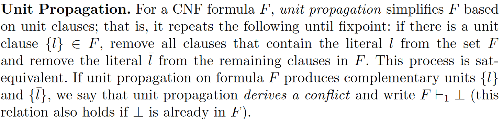
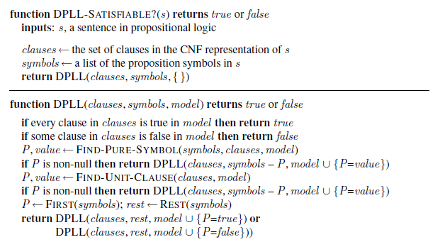
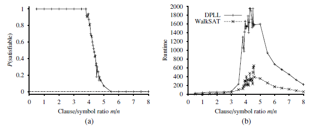

# Week 5 - Representing and Reasoning with Knowledge II

<h2>Reading for this Week</h2>

## Required Reading

### Lesson 1

Artificial Intelligence: A Modern Approach, Chapter 7, Sections 7.3 to 7.5 (if necessary, to revisit some material from Week 4)

### Lesson 2

Artificial Intelligence: A Modern Approach, Chapter 7, Section 7.6 up to the end of 7.6.1

Artificial Intelligence: A Modern Approach, Chapter 7, Section 7.6.2

### Lesson 3

Artificial Intelligence: A Modern Approach, Chapter 7, Section 7.6.2

### Lesson 4

Article - [Solving and Verifying the Boolean Pythagorean Triples Problem via Cube-and-Conquer, Heule, Kullmann, and Marek, Proceedings of SAT 2016](https://eu.alma.exlibrisgroup.com/leganto/public/44YORK_INST/citation/41417623110001381?auth=SAML)

## Optional Reading

### Lesson 1

Cormen, Leiserson, Rivest, Stein, [Introduction to Algorithms](https://eu.alma.exlibrisgroup.com/leganto/public/44YORK_INST/citation/37581462510001381?auth=SAML). (3rd ed) Chapter 34 up to (not including) Section 34.1 (pp. 1048-1053)

### Lesson 3

Artificial Intelligence: A Modern Approach, Chapter 7, Section 7.6.3

## Contents

1. [The Satisfiability Problem in Propositional Logic](#the-satisfiability-problem-in-propositional-logic)
    1. [What is the Satisfiability Problem?](#what-is-the-satisfiability-problem)
    2. [Entailment and SAT](#entailment-and-sat)
2. [A Complete Backtracking Algorithm for SAT](#a-complete-backtracking-algorithm-for-sat)
    1. [DPLL - A Backtracking Algorithm](#dpll---a-backtracking-algorithm)
3. [An Incomplete Randomised Algorithm for SAT](#an-incomplete-randomised-algorithm-for-sat)
4. [Scalability of SAT](#scalability-of-sat)

## The Satisfiability Problem in Propositional Logic

### What is the Satisfiability Problem?

The Satisfiability Problem (SAT) is the problem of finding a model that satisfies a logical formula OR proving that there is no such model. This is an NP complete algorithm, meaning it is both in NP and NP-hard. An algorithm is NP-hard if every NP problem can be transformed into this problem in polynomial time (it isn't necessarily NP itself). If an NP-complete problem can be solved (i.e. a solution can be found for it) in polynomial time, this will verify the P versus NP problem that we face in computer science.

Anyway. SAT is NP complete - it is possible to verify that a model satisfies (or doesn't, which is harder) a logical formula in polynomial time. However, the best known algorithms for finding a solution are exponential, which is worse than polynomial ($O(2^n)$ is worse than $O(n^2)$).

Last week, we dealt with algorithms that actually solved this problem using constraints (that is, our propositional logic was written as Horn clauses). But what if we introduce logic that isn't a Horn clause? For example, we might know that either Bob or Charlie went outside ($B_o\lor C_o$), which is not a Horn clause. What now? Forward and backward chaining don't support this.

### Entailment and SAT

For a sentence $a$ to be entailed by a formula $F$, $a$ must be satisfied in all models that also satisfy $F$. That's what $F\vDash a$ means. This would be a very difficult thing to prove because the number of models that represent $F$ is $2^F$ - exponential. The alternative, however, is to disprove the opposite - that the formula $F\land\lnot a$ is *unsatisfiable*. If there are no models that *satisfy* this formula, then $a$ is entailed.

Technically, what this means is that the problem space is still exponential, but, given a good implementation, you don't have to search the entire problem space if you're looking for a single counterexample. Obviously, since P versus NP hasn't been solved, we haven't found a way to solve the SAT problem using a polynomial problem space.

#### Sudoku as SAT

Sudoku is a simple game that I'm sure we've all played at some point in our lives. Take a 9x9 grid and put numbers in the tiles such that a few rules are satisfied: each 3x3 grid, each row, and each column has one instance of the numbers 1 to 9.

Let's look at a single 3x3 grid. Within each grid, there must be at-most-one and at-least-one (exactly one) of each number. This can be represented in propositional logic for the number 2 (for example) with 3 available tiles thusly:

$$
\lnot A2\lor\lnot B2\\
\lnot A2\lor\lnot C2\\
\lnot B2\lor\lnot C2
$$

We can also do the same for each tile that has one of 3 numbers missing:

$$
\lnot A2\lor\lnot A3\\
\lnot A2\lor\lnot A4\\
\lnot A3\lor\lnot A4
$$

and one final clause that says the tile has at least one number in it:

$$A2\lor A3\lor A4$$

This process is repeated for every number and tile that doesn't have a number in it yet. By combining the last two sets of clauses, we guarantee that each tile has exactly one digit in it. The at-most-one clauses has complexity $O(n^2)$, which is improved in certain, more complex ways, but we can say that the worst case for this is polynomial.

## A Complete Backtracking Algorithm for SAT

Awesome, this is where we start using search algorithms again. Logical inference for SAT problems is essentially a search algorithm using boolean logic.

### DPLL - A Backtracking Algorithm

DPLL sadly is not an acronym that means anything, it's just author initials for the original algorithm. Anyway, it was developed in 1960 (or 1962). It's just a total enumeration of models that works in a depth first fashion - it's a DFS that takes a set of clauses as input. It has three main advantages over the inference algorithms introduced last week:

- Early Termination
  - This allows us to determine the truth of a sentence even in a **partial model**. Early termination reduces the runtime of the algorithm in the search.
- Pure Symbol Heuristic
  - This heuristic is a symbol that appears with the same sign in all clauses - it's either always positive or always negative during the search
  - This means that, if a symbol appears the same in every clause, the clause can be ignored for every model in which the pure symbol appears. For example,
    - $(A\lor \lnot B)$, $(\lnot B\lor C)$, $(C\lor A)$
    - $B$ is pure because it is always negative. So, if $B=false$, the clauses in which $B$ appears are already known to be true
- Unit Clause Heuristic
  - A unit clause in DPLL is slightly different to the unit clause defined last week - all literals in the clause bar one are assigned to *false* by the model.
  - For example, if $B=true$ then $(\lnot B\lor \lnot C)$ reduces to $\lnot C$, which is a unit clause.
  - Assigning one unit clause can create another unit clause - called **unit propagation** - This also means that it acts like forward chaining in the case of definite clauses :)
  

Step by step:

1. Start with an empty set
2. First call to `DPLL` applies the pure symbol heuristic and begins recursion until either all clauses are true or any clause is false
3. Once pure symbol children are exhausted at any given node, the algorithm applies the unit clause heuristic
4. Once these are exhausted, the algorithm just takes the first symbol and assigns true or false to it in the next recursive call
5. Because of the `or` operator in the last two lines, any recursive call that returns false will backtrack up the tree. Incidentally, it also backs up if it returns true, but it will only do this once every clause is satisfied.

Honestly, there's not really much to say about it other than, it works. Implementations of the pure symbol and unit clause heuristics aren't covered in the book, so this would have to be further reading if you wanted to implement the algorithm in Python

## An Incomplete Randomised Algorithm for SAT

It sounds counterintuitive, but we can use pseudorandom programming to walk through the space of full models (as opposed to the partial models generated by DPLL). Here, we introduce the algorithm **WalkSAT**, which is part of a class of local search algorithms.

### WalkSAT

We can choose a full model of a problem and check to see if it satisfies all the clauses we provide. If the model does not satisfy the clauses, we flip a symbol in an unsatisfied clause and test that. We can choose which symbol to flip in two ways:

1. Min-conflicts algorithm minimises the number of unsatisfied clauses in the new state (Chapter 6 of textbook)
2. A random walk step picks the symbol, duh, randomly

The main problem with this algorithm is that, because of the random nature and the lack of memory to hold visited states, this algorithm will never terminate if the clauses are unsatisfiable. This is what makes the algorithm *incomplete*

### Compared with DPLL

These two algorithms are complementary: problems that are difficult for DPLL to solve are typically easy for the randomness of WalkSAT to deal with, and vice versa. This is because there are problems where the heuristics just don't help much, or the solutions are too deep for the recursion. There are also approaches called portfolios that apply both DPLL and WalkSAT.

It is, however, difficult to statistically compare the two since they are vastly different from one another (DPLL runs in a deterministic time, while WalkSAT is non-deterministic). We can compare them empirically by testing them in experiments.

### Random SAT Problems

Some problems are harder than others. We know that SAT is, in general, an NP-complete problem class, meaning there are problems that require at least exponential run time to solve. This means that a deterministic algorithm like DPLL runs very very slowly and will struggle to find a solution if a solution is rare. Take the n-queens problem from like week 2 or something. This is tricky for backtracking algorithms to solve. It turns out this is really simple for a local search method like min-conflicts (and therefore WalkSAT).

This is because the problem is **underconstrained**, which essentially means that, for the number of variables in play, there are relatively few clauses constraining them. This means that the solution density is high such that any random initial assignment is going to have a solution nearby.

So how can we quantify how constrained a problem is? We can generate random sentences using the form $CNF_k(m,n)$ where $k$ is the length of a clause, $m$ is the number of clauses in a sentence, and $n$ is the number of symbols. Each clause is not duplicated, and each symbol in a clause is unique.

We can measure the probability of satisfiability based on how constrained a problem is

What this also shows us is that the difficulty of a problem (represented by runtime) is affected by the level of constraint, but it peaks at a certain point before coming back down. Underconstrained problems are easy and overconstrained problems are, while not as easy, still easier than those found at the threshold.

Overconstrained problems are easier to determine the satisfiability because of the high number of conflicts that arise. Earlier conflicts means a drastic reduction in the search space, leading to faster detection of unsatisfiability.

## Scalability of SAT
