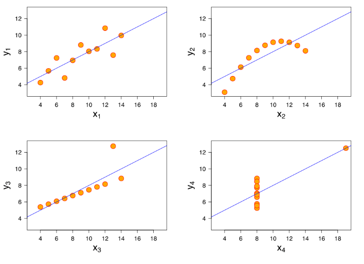

# Machine Learning with Neural Networks

<h2>Reading for this Week</h2>

## Required Reading

### Lesson 1

Data Mining, Sections 1.2, 3.2, and 4.6 (selected subsections)

### Lesson 2

Artificial Intelligence: A Modern Approach Chapter 22 section 22.1 to 22.4

## Optional Reading

Artificial Intelligence: A Modern Approach Chapter 19 section 19.6

AIMA Chapter 22 Section 22.5 to 22.8

Given that this is stuff that I've kind of been doing for a little while (at least linear regression is), this might be a bit of an overview if there is any programming to be done. Otherwise, I might just go into some extra detail, particularly on the neural networks!

## Contents

1. [Regression and Classification with Linear Models](#regression-and-classification-with-linear-models)
2. [Neural Networks and Deep Learning](#neural-networks-and-deep-learning)
3. [Perils of Machine Learning in the Real World](#perils-of-machine-learning-in-the-real-world) (sounds like fear-mongering lmao)

## Regression and Classification with Linear Models

So, what is **linear regression**? I've been using it since my undergrad, so I ought to know how it works right? Wrong, I've kinda just been using it without knowing how the machine gets to its answer.

Linear regression does what it says on the tin, it predicts a numerical value based on the summation of variable input, weighted by some weight value $w$:

$$y=w_0 + (w_1\times a_1)$$
or for N dimensions:
$$y=w_0+\sum_{N=1}^N(w_N\times a_N)$$

Lovely that we can extend this general equation into multiple dimensions. So, we use this to predict $y$ for a series of input values. But how do we get $w$?

### Least Squares Linear Regression

Now that we have this equation, the useful information is moreso the difference between the actual data point and the predicted data point. Across a series of values, we calculate the sum of the square differences as:

$$\sum_{i=1}^n(x^{(i)}-\sum_{j=0}^kw_ja_j^{(i)})^2$$

Okay, great. This isn't that pretty given the pair of sums, but this is useful. Our goal is to minimise this. We do this with a bit of linear algebra that I don't fully understand, but it involves a bit of work with matrices. Maybe brush up on matrix inversions and such. I've implemented [a bit](../Programming/Extras/least_squares.py) in python. Pretty sexy imo. It aims to find best values for $w_0$ and $w_i$ that minimise the residuals using the normal equation: $$\beta=(X^TX)^{-1}X^Ty$$

It is easy to see, really, that linear regression is not particularly effective at modelling interactions that are not, well, linear:

This set of particular graphs is called Anscombe's Quartet. of the four, only the first is really a linear fit, even if only loosely. The third highlights how anomalies are a part of the regression, and can throw off the predictions by some margin. The second shows poor fit of a non-linear dataset, and the last is just crap.

### Logistic Regression

Linear regression can technically be used in classification of just about any categorical data too. We can use it as a numeric *membership function*.

## Neural Networks and Deep Learning

## Perils of Machine Learning in the Real World
