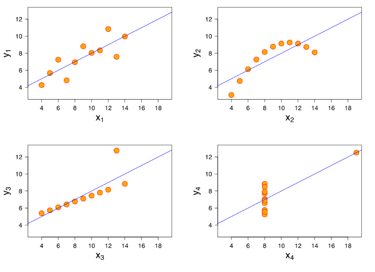
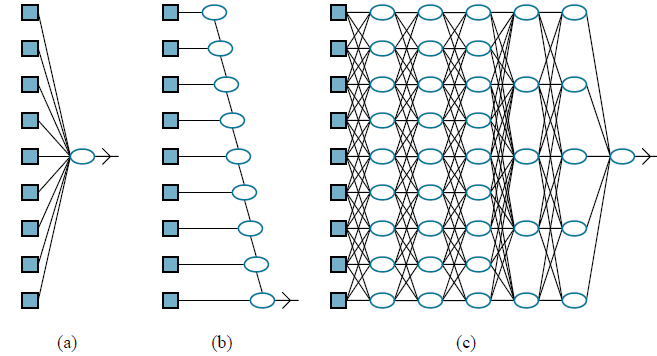
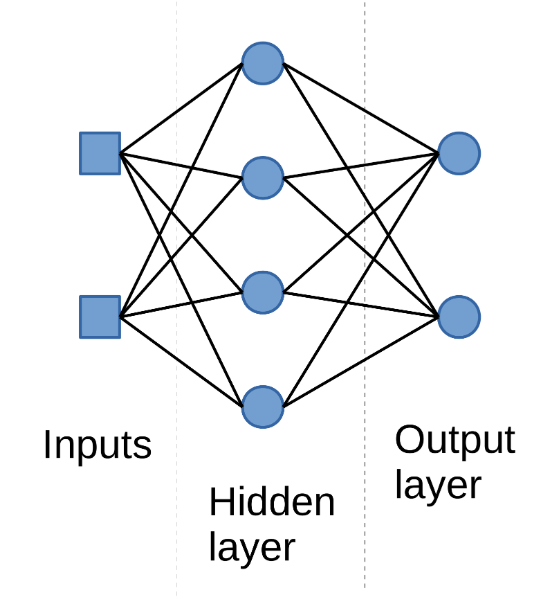
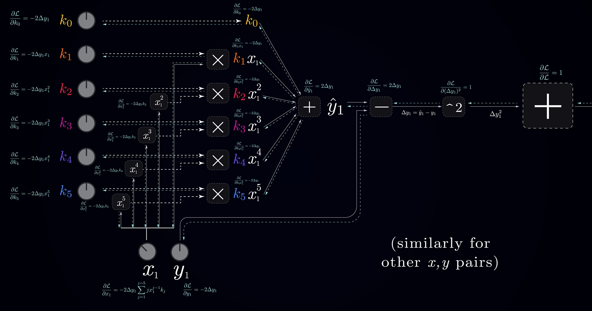
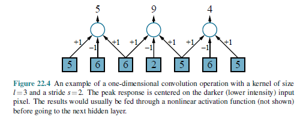
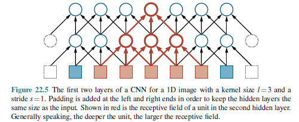
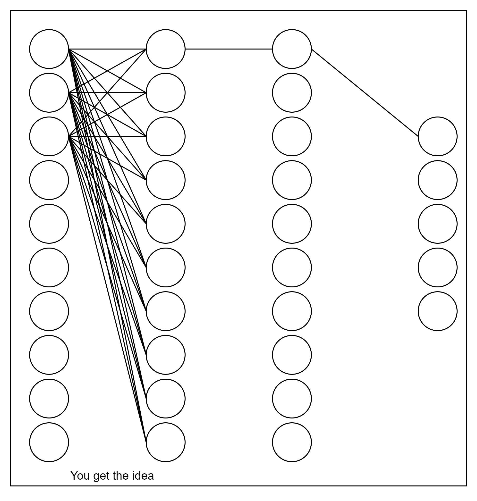

# Machine Learning with Neural Networks

<h2>Reading for this Week</h2>

## Required Reading

### Lesson 1

Data Mining, Sections 1.2, 3.2, and 4.6 (selected subsections)

### Lesson 2

Artificial Intelligence: A Modern Approach Chapter 22 section 22.1 to 22.4

## Optional Reading

Artificial Intelligence: A Modern Approach Chapter 19 section 19.6

AIMA Chapter 22 Section 22.5 to 22.8

Given that this is stuff that I've kind of been doing for a little while (at least linear regression is), this might be a bit of an overview if there is any programming to be done. Otherwise, I might just go into some extra detail, particularly on the neural networks!

## Contents

1. [Regression and Classification with Linear Models](#regression-and-classification-with-linear-models)
2. [Neural Networks and Deep Learning](#neural-networks-and-deep-learning)
3. [Perils of Machine Learning in the Real World](#perils-of-machine-learning-in-the-real-world) (sounds like fear-mongering lmao)

## Regression and Classification with Linear Models

So, what is **linear regression**? I've been using it since my undergrad, so I ought to know how it works right? Wrong, I've kinda just been using it without knowing how the machine gets to its answer.

Linear regression does what it says on the tin, it predicts a numerical value based on the summation of variable input, weighted by some weight value $w$:

$$y=w_0 + (w_1\times a_1)$$
or for N dimensions:
$$y=w_0+\sum_{N=1}^N(w_N\times a_N)$$

Lovely that we can extend this general equation into multiple dimensions. So, we use this to predict $y$ for a series of input values. But how do we get $w$?

### Least Squares Linear Regression

Now that we have this equation, the useful information is moreso the difference between the actual data point and the predicted data point. Across a series of values, we calculate the sum of the square differences as:

$$\sum_{i=1}^n(x^{(i)}-\sum_{j=0}^kw_ja_j^{(i)})^2$$

Okay, great. This isn't that pretty given the pair of sums, but this is useful. Our goal is to minimise this. We do this with a bit of linear algebra that I don't fully understand, but it involves a bit of work with matrices. Maybe brush up on matrix inversions and such. I've implemented [a bit](../Programming/Extras/least_squares.py) in python. Pretty sexy imo. It aims to find best values for $w_0$ and $w_i$ that minimise the residuals using the normal equation: $$\beta=(X^TX)^{-1}X^Ty$$

It is easy to see, really, that linear regression is not particularly effective at modelling interactions that are not, well, linear:

This set of particular graphs is called Anscombe's Quartet. Of the four, only the first is really a linear fit, even if only loosely. The third highlights how anomalies are a part of the regression, and can throw off the predictions by some margin. The second shows poor fit of a non-linear dataset, and the last is just crap.

### Logistic Regression

Linear regression can technically be used in classification of just about any categorical data too. We can use it as a numeric *membership function*. Slight problem with this is that, while this is supposed to mimic the probability of an instance's membership, the actual values for a **multiresponse linear regression** can fall outside the values of 0-1. Aside from this, the linear regression assumes that our values are drawn from a normally distributed space, and that features are independent of one another. So we need an alternative.

Enter **Logistic Regression**. This is a slight variation on the linear regression that we used earlier. We replace the original target variable with a logit-transformed version. This transformed variable can now be approximated using a linear function as we did with linear regression. This is why we often refer to logistic regression as an instance of the **Generalised Linear Model (GLM)**. Linear regression also is, but we call it ordinary least squares (OLS).

Instead of using the squared error to measure goodness of fit, logistic regression uses the **log-likelihood**, which is given using a horrible equation:

$$\sum_{i=1}^{n} \left( (1 - x^{(i)}) \log\left(1 - \Pr\lbrack 1 \mid a_1^{(i)}, a_2^{(i)}, \dots, a_k^{(i)} \rbrack \right) + x^{(i)} \log\left(\Pr\lbrack 1 \mid a_1^{(i)}, a_2^{(i)}, \dots, a_k^{(i)} \rbrack \right) \right)
$$

Instead of minimising the squared error, however, our job is to maximise the log-likelihood. This can be done iteratively, maybe I'll get [some code](../Programming/Extras/logistic_regression.py) for that. We can also generalise this for multiple classes, but we have to assume they are interdependent on one another.

## Neural Networks and Deep Learning

This is going to be the most interesting portion of this week's content. Neural networks are, in reality, similar to logistic regression in nature. Each neuron in a network is mathematically just a nonlinear regression model combined with an activation function which 'fires' the neuron. The actual connection to neural networks in nature is superficial, but it works well.

One of the reasons why neural networks have advantages over logistic and linear regression is the ability to express nonlinearity and interdependence between features. This does somewhat complicate how easy it is for a human to interpret the inner workings of the neural network (since we start representing things in much higher dimensions), which is what makes deep learning seem so scary to the uninformed (and perhaps the too-well informed).

Neural networks also manage to increase the length of the path from each input to the output. We can look at linear and logistic regression as a neural network with only input nodes and one output node, with no intermediate paths in between. The image below shows how linear regression is a shallow model, decision list representations can have long paths, and neural networks can have long paths and interplay between features:

### FeedForward Networks

As the name implies, **feedforward networks** are unidirectional, where the results from one node feed directly into the next. Each node is more technically called a **unit**. These networks do not have loops and there is a predictable flow from input to output. On the other hand, **recurrent networks** support loops where the intermediate or final outputs are fed back into the input.

Boolean logical functions are examples of feedforward networks. Logic circuits just take 1 or 0 as inputs and each node implements a boolean function. This is a special kind of network, where normal networks make use of continuous variables instead of binary inputs.

Some (not all) input nodes are parameters of the network, which are adjusted during training to fit the data.

Each unit takes inputs and returns an output based on a nonlinear function with the following form:

$$a_j=g_j(\sum_i w_{i,j}a_i)\equiv g_j(\text{input}_j)$$

where $g_j$ is the activation function and $\text{input}_j$ is the weighted sum of the inputs to the unit $j$. We add a dummy unit ($j=0$) to each unit with a weight. This allows the weighted input ($\text{input}_j$) to be nonzero even if preceeding outputs are zero.

The activation function, $g_j$ is nonlinear. This is to allow the network to be expressive in its representation of functions (since we're still trying to prove a hypothesis here). A few different activation functions are used. Here are some of the most common:

1. Sigmoid
    1. Just like with logistic regression
    2. $\sigma(x)=1\(1+e^{-x})$
2. The Rectified Linear Unit (ReLU)
    1. $ReLU(x) = max(0, x)$
3. Softplus
    1. A smoothed version of ReLU
    2. $\text{softplus}(x)=\log(1+e^x)$
4. Tanh
    1. $tanh(x)=\frac{e^{2x}-1}{e^{2x}+1}$
    2. This is a scaled and shifted version of the sigmoid

What's odd about these functions is that, in a single-layer neural network, functions as simple as a logicl XOR cannot be represented and this is because there is no straight line boundary that separates 1 and 0. What this means is that a single-layer neural network with a logistic or hard threshold function can only produce a linear (or hyperplane) decision boundary.

What we then need are more LAYERS. How can we represent more layers mathematically? Here's the shorthand. If we use $W$ to represent the matrix containing weights at each level of the network, we can represent the hypothesis space as:

$$h_w(x)=g^{(2)}(W^{(2)}g^{(1)}(W^{(1)}x))$$

Problem is, it's hard to write this in shorter form, but I can represent it in function composition to make it more legible:

$$h_w(x)=(g_2 \circ W_2 \circ g_1 \circ W_1)(x)$$

Lovely.

I've tried making some code for this but I think I'll have to revisit it once I understand better what I'm looking at

### Multi-Layer Neural Networks

So, we've kind of seen how a single-layer neural network struggles to represent some functions like XOR because there isn't a single hyperplane that can classify its outputs. Not ideal. However, if we introduce a second nonlinear layer to this network (a **hidden layer**) we can generate a decision boundary that is non-linear!

There's a lot of really gross maths in here about loss functions and learning but here we go anyway

This builds on a concept used in supervised learning called **gradient descent** (see chapter 19.6 in AIML) (opposite to the gradient ascent used in logistic regression!). The gradient that we aim to minimise in this instance is that of the loss function with respect to the weights. Descending this gradient to find the global minimum optimises the weights for each input. This process is simple for nodes leading into units in the output layer, but for those not directly connected to the output, this is a little different.

[Something that will make all of this a lot easier, but takes 40 minutes](https://www.youtube.com/watch?v=SmZmBKc7Lrs)

<h4>Gradient Descent</h4>

Gradient descent uses partial derivatives of the loss function with respect to the weight to optimise the weight incrementally until converging on the global minimum

I won't go through the step by step of it here, but it uses the chain rule of calculus to work out the partial derivatives. By the end of it all, we get a function that updates the weight of each parameter:

$$w_i\leftarrow w_i + a\sum_j (y_j-h_w(x_j))\times x_j$$

where $a$ is known as the learning rate of the function.

This is known as the batch gradient descent. There are other types of gradient descent, specifically there is stochastic gradient descent, that randomly selects a small sample of training examples at each step

The thing that makes the neural network version of this gradient descent is that for each layer away from the output, we have to apply the chain rule one more time, which, if you're not too familiar, isn't tooooooo bad I don't think?

> It's not! **Back-propagation** is a feature of gradient descent that essentially passes the loss function backwards along the forward feed, using partial differentials of each layer function (like ReLU and softmax) to determine how much to adjust each parameter by!

Anyway, we need to talk about error. The neural network's units have a sort of perceived error where they receive their inputs. We define the error as $\Delta_n=-2(\hat{y}-y)g_5^\prime(\text{in}_5)$, then the gradient with respect to an input unit's weight $w_m$ is just $\Delta_n a_m$, where $a$ the learning rate of the unit before. We can use this term to determine which direction and by how much the parameter should be shifted.

This perceived error is **back-propagated** through the network recursively. I've exhausted myself going through this I think.

Anyway, nice image to finish off with:

This graph representation of a multi-layered network has 8 units. Since each unit has a given number of inputs, each input has a weight and, as such, there are 16 weights in this image (2 for each of the hidden layer's units and 4 for the output layer's)

Before moving on, here's a screenshot from [the video](https://youtu.be/SmZmBKc7Lrs?t=2154) that really encapsulates what back-propagation is all about:

#### Encoding Values

When it comes to continuous variables for both input and output, this isn't difficult - there is no encoding that really needs to be done since we're already using numerical values. However, when it comes to categorical values, we have to do something different.

We might initially think "okay, let's just assign each value a number" which sounds perfectly normal. That is, however, until you realise that numbers have adjacency (for example, if you have a list of possible values like ['hungry', 'tired', 'happy', 'enamoured'], tired and happy could have values of 2 and 3). Given that the network is a function composed of continuous functions, it would have to pay attention to this adjacency despite this adjacency being semantically meaningless.

To combat this, we use **one-hot** encoding. What this means is that each value is assigned to a bit's position in a number. If an instance belongs to a class, the bit in that number corresponding to the class is turned to 1, while all others are 0.

In the list we defined above, if we have an instance belonging to 'happy', we could represent this in one-hot like $0010$

It turns out that ensuring adjacency isn't all that easy to do anyway. Let's say you have an image with x and y coordinates and an extra value for RGB. This would be all well and good, we could ensure adjacency for the input layer by putting coordinated pixels together, but that all gets completely lost in the hidden layers, especially if they are fully connected. What often gets used instead there is **convolutional neural networks**

### Convolutional Neural Networks

First, let's go back to why images don't work in classical neural networks. Because of the hidden layers, adjacency is not maintained throughout the training procedure. What this means is that the result of training on an unperturbed image would be the same as if it had been randomly distorted. Another big problem is that, for n pixels and n units in the first hidden layer, and the input and hidden layer are fully connected, that's $n^2$ weights. In a 1 megapixel image, that's a trillion weights to consider. We have come face to face with the monster that affects most learning problems to some degree: the **Curse of Dimensionality**. This, as well as the lack of adjacency, makes a classical feedforward network unfeasible.

So, how do we get our neural network to *respect* adjacency? Computer scientists, once again, have taken inspiration from nature. Animal brains cannot be responsive to everything within their field of view. I mean, you're looking at this through a screen, are you aware of what's behind the screen, well within your periphery? To mimic this behaviour, we use a **receptive field** or, more generally, a **filter**. A pattern of weights that is replicated in other local regions is called a **kernel**.

This receptive field passes a small local region of the input data to each unit in the hidden layer. In broad terms, the filter is a *type* of neuron, and each unit in the convolutional layer(s) is a different instance of this filter. Different layers can (and usually do) have different filters.

The main benefits of this approach is to respect adjacency (a property propagated throughout the network) and to reduce the number of weights. We also introduce the idea of **spatial invariance** - approximately, anything that is detectable in a local region would look the same in another local region. That is to say, if you had an eye in one local receptive field, another eye would look roughly the same in another part of the image. This concept holds for time-series data, which exhibits temporal invariance - a word said in the morning is still the same word said at night. These are instances of kernels.

Have a look at this image which kind of describes the process using a 1-dimensional vector. This can easily be scaled up to higher dimensions:

This is the process of convolution. Here, we have a kernel of size $l=3$. The kernel (or filter) slides over the image vector with a given stride. This is determined by the distance between the *centers* of each kernel. In this case, that's 2. This does mean that the neural network isn't fully connected. It's important to note in this image that the numbers {5, 6, 6...} are not values from the image, but weights.

The values taken from each kernel (the +1, -1, +1) are placed in a matrix, which can be multiplied with the weight vector to produce the convoluted weight values to pass to the next layer (in this case 5, 9 and 4).

Next, to make things more complicated, there will be more than one kernel. There will be $d$ kernels, which adds an extra dimension. Given a stride of 1, the output from the convolution will be $d$ times larger, corresponding to the size of the extra dimension. For a 2D image input, the hidden units are organised in a 3D array.

This is where we get to the example from the Canvas webpage. The filter moves across the image with two stride values $s_x$ and $s_y$. The filter is a 3x3 matrix moving across a 6x6 image. There is only one kernel in this case, so the dimensions of the filter are actually only 3x3x1. The depth of a kernel is always the same as that of the previous layer. In this sense, if the image were in colour (we could use an extra filter for each colour), it would be a 6x6x3 image, with a 3x3x3 filter.

The output volume size can be calculated by taking the image of dimensions $A\times B\times C$ and the filter of dimensions $P\times Q\times C$. The first dimension of the output would have $A-P+1$ positions, and the second would have $B-Q+1$ positions. $C$ is maintained throughout since it is not semantically adjacent.

#### How the Receptive Field Changes

The deeper you go in a CNN, the larger a receptive field for each unit becomes. Bit weird to describe, but this image shows how a unit at depth 2 receives much more information than a unit at depth 1

So, mathematically, for a unit in the $m$ th layer, if the stride is 1 and the kernel size is $l$, the size of the receptive field is $(l-1)m+1$, growing linearly with $m$. For any other size of stride, the receptive field actually grows exponentially with depth.

#### Working out Numbers of Weights

For the exam, I'll probably be asked about how many weights are in a network, or how many at each layer of the network. Let's do this for fully connected networks first.

If we have 10 inputs and two fully connected hidden layers with 10 neurons each, leading to a fully connected output layer of 5 neurons. How many weights is that?

Each input is connected to each of the next layer (so there are $10\times 10$ weights there). The same goes for the next layer, so another $10\times 10$ weights there. These are connected to 5 outputs, so $10\times 5$ there. Cool. Easy. EXCEPT you must remember that each neuron also has a bias term, so add 10 for the first layer, 10 for the next and 5 for the last. We now have 275 weights in this diagram! Yay!

Now, how about convoluted layers?

Things get a little weird here. Let's take the scenario where you have a 15x15x1 image. The first convoluted layer has a filter size of 3x3x1 and there are 5 neurons here. Quick maths tells us this first layer has $3\times 3\times 1=9$ weights PLUS the bias, so $10$ for each neuron. That's 50 weights for the first layer. Excellent. Now for the next one.

The output size of the first layer is $\frac{15-3}{s=1}+1=13$. This means the output of the first layer is of size 13x13x5. Doesn't matter about the 5 since the depth doesn't get convoluted anyway. It also turns out that the massive output size doesn't get passed on to the next layer because it's convoluted, rather than fully connected.

We can find the number of weights for the second layer in the same way we did for the first. If the kernel size is 2x2x5, so the number of weights is $2\times 2\times 5 + 1 = 21$ for each neuron, of which there are five. The total weight for the second layer is then 105. That's it.

How about the last layer? This one is fully connected to 10 output neurons (yikes!). Same way we found the output volume of the first layer, we can find the volume of this output too. The input volume for this layer is 13x13x1, and the filter volume is 2x2x5. The output size is $(13-2)+1=12$, so the volume is 12x12x1. One??? Yeah! The depth is not convoluted so it takes the same value as the initial input. So, we have a volume of 12x12, which is just 144. We have 5 neurons so the number of output values from this layer is $144\times 5=720$. That's 720 input values to the final layer, which has 10 neurons in it. Each of these 10 neurons also has a bias, so the final number of weights for this layer is $720\times 10+10=7210$

The total number of weights in this network, then, is $50+105+7210=7365$! Lovely.

## Perils of Machine Learning in the Real World

This is a really small section but it's just about how machine learning is used in the real world and how we should be cautious about how we use it and how reliant we become on it.

Machine learning is used in autonomous systems like driverless cars and, well, we all know what happens with those. Same goes for trains and such. One of the main issues with machine learning is interpretability. For example, in a neural network, we can see that a model has been trained well to understand the difference between a dog and a human, but we can't necessarily elucidate *how* it knows that. What this means is that we can't determine under which circumstances a model might get that wrong.
