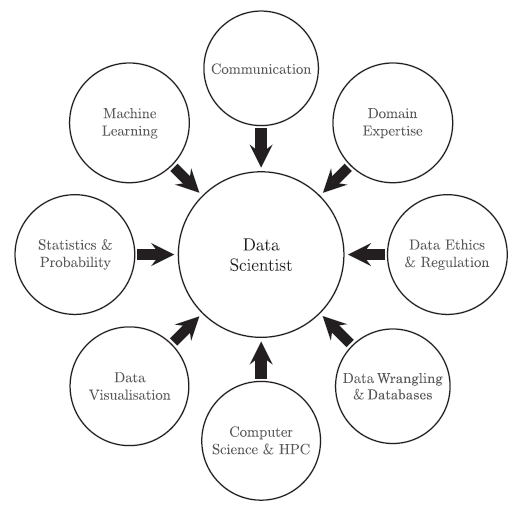
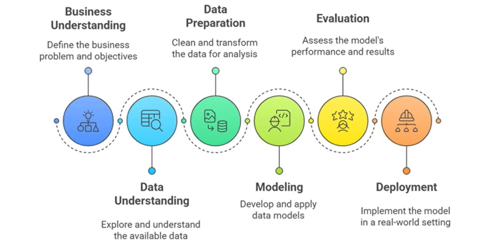

# Week 1: An Introduction to Big Data Analytics

## Weekly Learning Outcomes

1. Explain many reasons we might want to ask questions of data. (MLO 2)
2. Describe the way data is structured in analytics. (MLO 1)
3. Describe a reasonable data science process, and explain why each step is important. (MLO 1)
4. Explain why data privacy is an important concerns in big data analytics. (MLO 5)

## Reading for this Week

1. Chapter 1 of "Data Science" Kelleher and Tierney, MIT Press, 2018.
2. Case Study: [Big data can help doctors predict which COVID patients will become seriously ill](https://theconversation.com/big-data-can-help-doctors-predict-which-covid-patients-will-become-seriously-ill-153168)
3. Case Study: [The results of European football matches are becoming more predictable – new research](https://theconversation.com/the-results-of-european-football-matches-are-becoming-more-predictable-new-research-173690)
4. Case Study: [Digitized records from wildlife centers show the most common ways that humans harm wild animals](https://theconversation.com/digitized-records-from-wildlife-centers-show-the-most-common-ways-that-humans-harm-wild-animals-214819)

## Table of Contents

1. [The Reasons we ask Questions of Data](#lesson-1-the-reasons-we-ask-questions-of-data)
2. [The Data Science Process](#lesson-2-the-data-science-process)
3. [Describing the Structure of Data](#lesson-3-describing-the-structure-of-data)

## Lesson 1: The Reasons we ask Questions of Data

### Research Questions

I've just done a whole load about this in the Research Proposal Module. Research questions are all about finding things out. In the context of data analytics, they're questions you can use data to answer.

I don't plan to go into any detail here since research question formulation is a part of more general fields like research methods. But anyway, a research question needs to be narrow enough and measurable. There's no use in saying "Are beans better?". This is far too broad - what kinds of beans? better than what? better in what way? how much better?

A better question that that might be "Which types of beans are nutritionally better than other legumes?" Idk why I'm leaning into the beans thing here.

Anyway, a question must be answerable and, if you're into data like I am, it must be answerable with data.

### The Process of Generating a Question

Generating a research question is a daunting task, particularly at the start of your project design where you don't really have an idea - you just want to do a project.

There's an iterative process that people tend to follow:

1. Identify Importance
2. Assess Data Availability
3. Brainstorm Questions
4. Prioritise and Refine Question

It can be lengthy, but there are ways of kind of speeding it up like brainstorming techniques and I think there was something else that we did in research proposal.

### What is Data Science?

Looking at the real questions here. Reading through Kelleher and Tierney's 2018 book Data Science, they define data science as a separate field that encompasses, mostly, machine learning and data mining (plus a few extra bits). Everything that machine learning does - pattern finding, clustering, reinforcement learning - and all of data mining - association rule mining or anomaly detection - fall under data science.

Data science is useful for situations where the available data is large. That just really means anything that's too large for people to find patterns in themselves. It's also helpful for when data is not inherently human-interpretable. For example, a linear regression is possible for a person, but not exactly second nature.

### The History of Data

The book then goes on to talk about the history of data a little bit. I won't.

Data is data. It's everywhere and in everything that is either measurable or not yet measurable. It's always been there, we just haven't always been able to capture it.

### The Structure of Data

In the 70s, (okay yeah I am talking a bit about the history, sue me) data collection became so easily digitised and computerised that we got vast amounts of it. We had to store it somewhere. Thus was born the relational databse. Data were captured and placed in tables in databases as records. Relationships between tables allow for records to exist in many places and in many contexts. We use the structured query language (SQL) to access data from such a database, abstracting away the underlying knowledge of how the data itself is structured. Bam.

This sucks tho. Nobody likes using SQL (not necessarily true), and it can be cumbersome to send and access data as records in a table. Instead, there has been a movement to NoSQL databases, which store records as objects where all its fields are encapsulated within the object, rather than the table that holds it. A good example is using JSON objects to represent the attributes of the object. This is more lightweight and flexible - if an object only has a subset of attributes with values, it is allowed to only have that subset.

There are also distributed databases. These are great big behemoths that distribute the storage and processing of data across several servers. In querying one of these, you are asking servers to create partial query responses, then merge them before sending the full response back to you. Huge implications in terms of security, storage capacity and processing power. The *MapReduce* framework of Hadoop is a solid example of this.

Huh???

Why have I just done a deep dive into a bunch of philosophers and found out that Rene Descartes (*I think therefore I am*) had a daughter who died so he created an automaton of her???

### The History of Data Analytics

This is perhaps a little more interesting than the history of data itself.

Originally, statistics referred to the collection and analysis of data about the state such as demographics and economy. However, we have since applied the tools created in statistics to cover data as a whole.

Descriptive statistics summarise data. These include measures of central tendency (mean, median etc.) and measure of variance (such as the range). Lots of work in the 16-1700s by mathematicians, physicists and philosophers led to probability theory, which underpins an awful lot of statistical learning.

Carl Friedrich Gauss did a lot of things. He was the god of shortcuts (shoutout to the Art of the Shortcut). He developed the method of least squares, which allows us to find the best model that fits data such that error is minimised. This gave rise to linear and logistic regression which were extended into the artificial neural network.

Then comes visualisation. William Playfair, a Scottish engineer, invented statistical graphics around 1800. Because of him, we now have data visualisation and exploratory data analysis. He invented line charts, area charts, time-series data, bar charts and pie charts. Since then, as data have become larger and more complex, it's become more difficult to visualise data of higher dimensions.

Since we can't see things in any dimensions higher than 3, we need to reduce our dimensionality to that or lower. This can be done using a technique called t-distributed stochastic neighbour embedding (t-SNE).

Drawing into the 20th Century, Karl Pearson developed hypothesis testing (the guy that did Pearson correlation and its derivatives) and R. A. Fisher developed statistical methods for multivariate analysis (ANOVA etc.) and the maximum likelihood estimate to draw conclusions from the probabilities of events.

We start coming to what we now recognise as artificial intelligence and machine learning. It was around the 1940s that the mathematical model for a neural network was developed, information theory was introduced, classification problems were defined leading to nearest-neighbour models and eventually the birth of artificial intelligence in Dartmouth College.

There was a lot of reading for this lesson. Lots of it is contextual for data science. I won't go into it further, but I might like to read it another time.

## Lesson 2: The Data Science Process

In general, there are 6 steps in the data science process

1. Set Research Goals
2. Data Acquisition
3. Data Cleaning
    1. Takes around 80% of your time apparently
4. Analysis
5. Evaluate
6. Present Results

These constitute a relatively simple process

We also look at the CRISP-DM process - the cross-industry standard process for data mining

It's really not that complex.

1. Business Understanding
2. Data Understanding
3. Data Preparation
4. Data Modelling
5. Evaluation
6. Deployment

I really don't want to keep going since this is all stuff I've done before and the last part of this lesson is about data privacy, which we talk about more in week 7

## Lesson 3: Describing the Structure of Data

### Inputs

Let's talk about what data looks like before it goes in and what features to look out for. The main ones to talk about here are *concepts*, *instances* and *attributes*

#### Concepts

In data mining, whether we're looking to classify an instance, learn an association rule, derive a numerical result or find clusters, each of these is known as a *concept*. The exact value of this concept is known as the concept description.

For example, if I wanted to determine whether a telecoms customer will churn, the concept to learn would be the target feature `churn` and its description would be a 1 or a 0.

#### Instances

Very simple. If every record in a dataset is comprised of attributes, an instance is a particular record with a given set of attributes. For example, a person may be defined with a set of attributes Age, Name, Height, Weight. An instance of a person would have a value for each of these attributes.

#### Attributes

Following from that, we need to define attributes. These are the features of instances that characterise them. Attributes can take values and each value is of a certain data type. Typically, these fall into either continuous (misnomer since it often includes intgers) or categorical. Each can be subdivided into nominal, ordinal, interval and ratio. Nominal data is as the *name* implies LOL - categories with no tangible, mathematical relationship to each other. One step up is ordinal. These have an order - things like hot > tepid > cold. However, while these have an intrinsic order, there is no indication to the distance between values. This is where interval comes in. These are discontinuous numerical values (integers, typically) that do have both order and magnitude. Last is the ratio (or continuous numerical). This is an infinitely large value space since it includes the infinitely many ratio values.

Calling it there for this week. Short and sweet because it's already Thursday of week 2 lol
