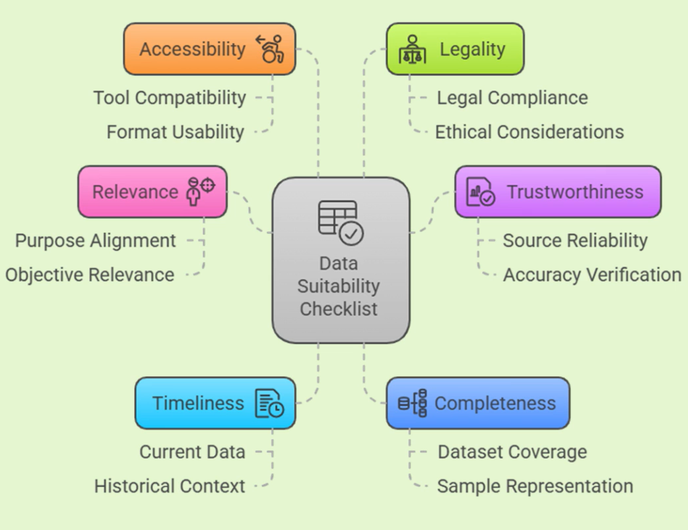
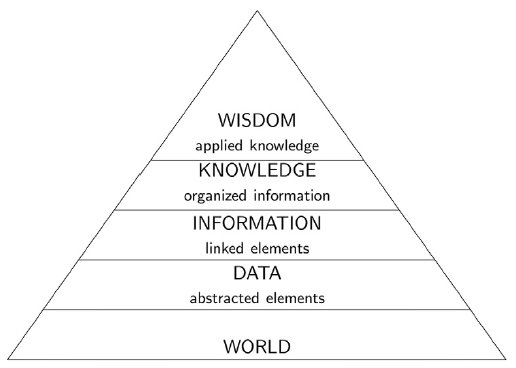
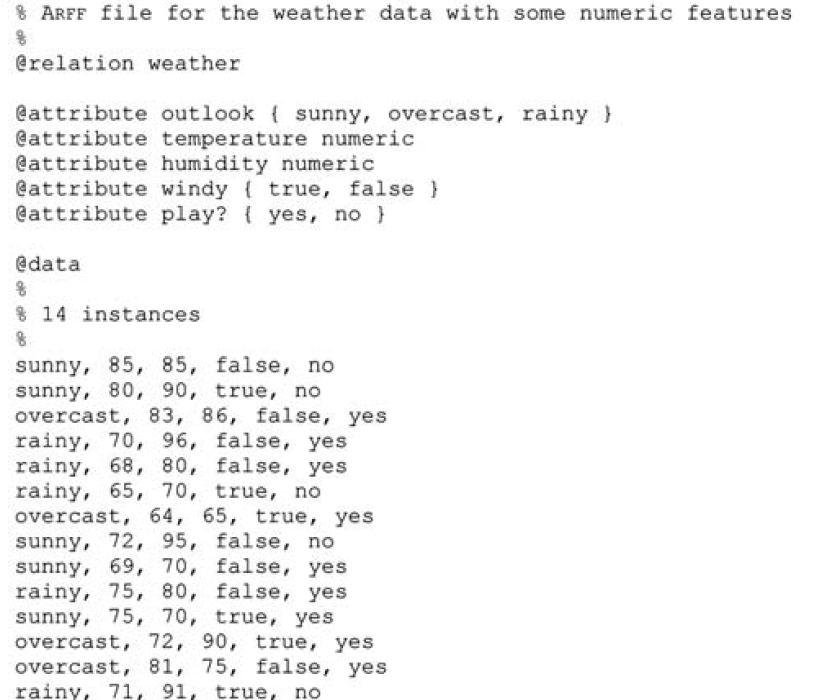

# Week 2: Prepping Data for Analysis

## Weekly Learning Outcomes

1. Evaluate the suitability of given data for use in analysis (MLO 2)
2. Transform and clean simple tabular data using several common techniques (MLO 2)
3. Extract and create features from simple tabular data (MLO 2)
4. Integrate data from diverse sources (including multiple tables) (MLO 2)

This is really bad. I've been ignoring this and working on my side project (not even my master's project :''''( ) not good

## Reading for this Week

### Lesson 1

1. Kelleher chapter 2 up to the section on CRISP-DM (already covered in week 1).
2. Section 2.4 from Witten et al.'s Data Mining: Practical Machine Learning Tools and Techniques.

### Lesson 2

1. Section 2.4.0-2.4.2 from Cielen et al.'s Introducing Data Science

### Lesson 3

1. Witten et al section 8.1

### Lesson 4

1. "Data preparation and integration" and "Creating the Analytics Base Table" from Kelleher chapter 3.

## Table of Contents

1. [The Suitability of Data](#lesson-1-the-suitability-of-data)
    1. [Why do we Worry About Suitability?](#why-do-we-worry-about-suitability)
    2. [What are Data and What is a Dataset?](#what-are-data-and-what-is-a-dataset)
    3. [The Data to Wisdom Pipeline](#the-data-to-wisdom-pipeline)
    4. [ARFF](#sike-lets-learn-about-arff)
2. [Cleaning Data](#lesson-2-cleaning-data)
    1. [The 5 Principles of Data Cleaning](#the-5-principles-of-data-cleaning)
    2. [The Main Problems to Solve with Cleaning](#the-main-problems-to-solve-with-cleaning)
    3. [Optional Activity - ARFF Reading](#optional-activity)
3. [Feature Extraction and Tabular Data](#lesson-3-feature-extraction-and-tabular-data)
    1. [Scheme-Independent Feature Selection](#scheme-independent-feature-selection)
    2. [Searching the Feature Space](#searching-the-feature-space)
    3. [Scheme-Specific Feature Selection](#scheme-specific-feature-selection)
4. [Data Integration](#lesson-4-data-integration)
    1. [The Analytics Base Table](#the-analytics-base-table)

## Lesson 1: The Suitability of Data

### Why do we Worry About Suitability?

When we are granted access to data, particularly data that isn't our own, we need to assess whether that data is suitable. Suitable data is good data and it must meet some requirements:

- Relevant
- Trustworthy
- Fit for purpose

The last one is a little lax since we can manipulate data to be more fit for purpose, but if it isn't relevant, it can't be fit for purpose.

Some other things that determine suitability are:

- Ethics and Law
- Completeness
- Accuracy
- Timeliness
- Accessibility

In the case that you're failing to acquire suitable data a number of issues could arise. If your data is not ethically collected, this could lead to ethical or legal ramifications. If your data was not collected for the purposes that you are using it for, there could be data missing that you have to go without or interpolate, or the data could have been collected in such a way that it introduces bias.

Moral is, always check for the background of the dataset - check if there's an update history to see how recent it is, check methodologies, check any money trails.

### What are Data and What is a Dataset?

Data (the plural form of *datum*) are abstractions of a real-world entity. Each entity is described by a set of attributes.

A dataset consists of the data relating to a collection of entities. For example, a datum might be an employee and the dataset would be the collection of data that represent that employee's company's other employees.

Having a read through of the next few pages, here are some things I want to make a quick note of:

- Interval data is not just integer. In fact, integer is closer to ratio than it is interval.
- Interval data is measured across a defined scale with an arbitrary interval between values and an arbitrary origin.
- Think dates for example. The interval between days is 24 hours, and that for between weeks is 7 days. While most computers use 1980 as their origin, this is arbitrary in terms of how real that origin is.

> Another slightly unexpected case of interval data is temperature. In the case of Celsius and Fahrenheit, zero doesn't represent anything real - it doesn't mean zero heat.
>
> However, for Kelvin, zero DOES mean zero heat and the zero-point there is not arbitrary - this means it is appropriate to use multiplication and division for Kelvin, but not for Celsius or Fahrenheit

- As objective as we like to think data science is, it is still prone to errors in human design
- A human chose which attributes to abstract away, which analysis methods to apply and how results are interpreted. All subjective
  - POSTPOSITIVISM

#### Other Types of Data

Aside from the main types (categorical vs continuous and their derivatives), we can have other interpretations of data.

Structured vs Unstructured data

> Structured data are those that can be represented using tables. The most structured data are those where each record is represented by the same set of attributes. We still see that a more object-oriented approach (using JSON for example), is structured, but less so. It's comparatively easier to perform data analysis on structured data
>
> Unstructured data, on the other hand, are data where each instance may have its own internal structure. Objects fall into this category, and unstructured data comprises a broader spectrum of datasets. For example, a dataset of webpages is unlikely to be uniform since each webpage may have different structures. Even within this, if you're taking information from one website where each page is a variation of others, the dataset we obtain from this website is more structured.
>
> At the other end, we have textual data - tweets, posts, blogs etc. that don't have any relational structure. The structure of text data is defined by linguistic laws (syntax) rather than computer-legible structures.

Raw vs Derived Data

> Raw data are those that represent an abstraction from a real measurement. For example, a person's height or weight, or the length of a text is tangible.
>
> Raw data can be decomposed into captured and exhaust data. Captured data are those collected through a direct measurement that is designed to gather that data. On the other hand, exhaust data are typically a by-product of a process. For example, the primary purpose of social media is to connect users. All the information that comes from the objects used as a medium (posts, images, tweets etc.) like who liked the post, who shared it, how many people have seen it are raw data, but not the primary data produced by users of social media.
>
> One common type of exhaust data is metadata. This is data that describe the primary data. For example, an Instagram post's metadata includes the number of likes, the comment section, the shares and views. Another example is the length, recipient and caller of a phone call. There is as much information to be gleaned from metadata as there is from the data itself, often more!
>
> In contrast, derived data are those that are generated from raw data. The average salary of an employee at a company is not a real value that represents any particular employee and is derived from the salaries of all other employees.
>
> *"It is frequently the case that the real value of a data science project is the identification of one or more important derived attributes tha provide insight into a problem"* - Kelleher & Tierney

### The Data to Wisdom Pipeline

To finish this lesson simply, let's look at wisdom. We often see wisdom as the goal - to be able to apply knowledge effectively and appropriately. To that end, there is a hierarchy of wisdom, knowledge, information and data.

- Data are created through abstractions of the world
- Information is data that are processed and contextualised so that it is meaningful to us
- Knowledge is information that has been learned and understood by a human such that it can be applied
- Wisdom is the appropriate application of appropriate knowledge

### SIKE Let's Learn About ARFF

So I thought that last bit was the end of this lesson but it isn't - we have to learn about ARFF - the machine learning data storage format used by Weka (I wonder if it's better for use with Python libraries too)

ARFF (attribute-relation file format) is a text-based input file format that is often used for machine learning. It's just like CSVs in the sense that tabular data is stored in them. However, the key difference is the amount of metadata that can be stored ahead of time.

In the image above, we see that attributes are defined before the dataset, marked using `@attribute` followed by the name and data type. Categorical attributes are defined by the available values in curly braces.

Another thing that ARFF does really well is sparse data. In a CSV market basket dataset, you'll have a whole load of zeroes. For any decently sized store, a customer will likely only buy a small subset of the total available items. This leads to sparse data (since all transactions would have an attribute for each item). ARFF represents sparse data differently. Each value that is NOT a 0 is represented by the attribute (column) number followed by the value, enclosed in braces:

$${1 X, 6 Y, 10 "Class A"}\\{1 B, 6 W, 10 "Class B"}$$

Everything else is either a 0 or missing

## Lesson 2: Cleaning Data

This is one of the most time-consuming parts of data analysis (up to ~80% of your time!) so it's important to get it right and to get it right, quickly.

### The 5 Principles of Data Cleaning

1. You can't fix problems until you can see them
2. Don't fix problems by making things worse
3. Justfy your fixes
4. Sometimes you shouldn't fix
5. Acknowledge residual uncertainty

Basically, if it ain't broke, don't fix it. We extend it to say, if it is broken, only fix it if you need to and be humble - your choices aren't perfect.

The point that interests me immediately is 2. Why would you make something worse to fix it? Well, in an example dataset of owners of the most valuable properties in different areas in the country, it may become clear that many properties' owners couldn't be reached and, as such, a lot of data is missing at the very top of the price range. A quick fix for this would be to omit anything with a null value. However, this wouldn't be a good idea since you'd be missing out on records with hugely influential values. A workaround may be required for this sort of situation. Basically, don't burn bridges before you've tried to cross them

### The Main Problems to Solve with Cleaning

- Missing Data
  - Imputation with forward/backward fill, mean/median fill
- Incorrect Data
  - Requires manual checking
  - Stripping whitespace is a common tool
- Outliers
  - The effects of outliers can be mitigated by using a less sensitive statistical measure
  - Median instead of mean
- Inconsistent Formats
  - Date formats can vary widely
  - Typically aim for a standard like ISO8601
- Normalising and Standardising
  - Constraining values to a specific range
  - Constraining mean and standard deviation to specific values (like 0 for mean and 1 for sd)

### Optional Activity

Of course it says optional, but I did it anyway. Have a look at [arff_reading.py](arff_reading.py)

## Lesson 3: Feature Extraction and Tabular Data

Picking the right features for your dataset is important. There are many reasons why a certain attribute should or shouldn't be chosen. It can be shown that the relevance of an attribute is important - adding an irrelevant attribute to a model can potentially lead to degradation of the accuracy of a model. For example, if we added an attribute where the values were randomly selected as 65% of one value, and 35% of another, this can degrade the performance of the model by 1-5%. Surprisingly, the addition of relevant attributes can also lead to poorer performance - too many features, particularly in a decision tree, lead to more and more sparse values for decisions to be based on as the tree becomes deeper.

### Scheme-Independent Feature Selection

So, how do we choose our features? Feature selection is an important part of the process. As someone with domain knowledge, this is typically simpler - if you know ahead of time which features you expect to be important, you can filter out the features that you don't expect to be important. Without domain knowledge, there are two ways to do this:

1. Filter Method
    1. Making an independent assessment based on the characteristics of the data
    2. This is done before any learning occurs
2. Wrapper Method
    1. Using the algorithm you ultimately intend to use to find out which features perform best
    2. The algorithm is incorporated into the selection procedure

Scheme-independent methods are not specific to any kind of algorithm that is used to perform data learning - i.e. if you have a specific algorithm in mind, the following methods can be used for that, and myriad others.

One method described is to use a decision tree classifier to filter out features that aren't relevant before performing another machine learning task like nearest neighbours. The number of features to be selected is the number of features actually used in the tree - some won't be included if the depth of the tree is limited.

Another method is to use a linear model (like a linear support vector machine or logistic regression) to separate classes along a decision boundary. These rank the features based on a coefficient indicating the importance of each feature. The number of features, however, should be chosen using a different method - typically domain knowledge is best, but iterative testing is another data-backed method if you lack that or just want to characterise a predictive model. We can also use recursive feature elimination where we just remove the lowest-ranked features until we have an optimal model.

One method of redundant and irrelevant feature reduction is to select features that correlate well with the target class, but are themselves not intercorrelated. Correlation can be described using symmetric uncertainty

$$U(A,B) = 2\frac{H(A)+H(B)-H(A,B)}{H(A)+H(B)}$$

Where $H$ is the entropy of a feature.

The goodness of a subset of features can be calculated as

$$\sum_{j}U(A_j,C)/\sqrt{\sum_{i}\sum_{j}U(A_i, A_j)}$$

The problem here is that, if all m features of a class correlate perfectly with each other and the target, the goodness of the entire set of features is $m/\sqrt{m^2} = 1$. This is not great as we want to avoid redundant attributes, so we need to break ties by choosing the smallest subset with the highest value.

The objective of this method is to maximise the value to maximise relevance and minimise redundancy.

### Searching the Feature Space

This is actually just a case of looking at search algorithms. The feature space can be represented as a graph or a tree and can be traversed. Any cost functions typically pertain to the cross-validated score of each feature set.

Basic search algorithms include forward selection and backward elimination greedy searches. Bidirectional search combines the two, best-first works well for exploring the entire search space. We also use genetic algorithms to evolve good subsets.

### Scheme-Specific Feature Selection

The performance of a feature using scheme specific selection is determined using cross validation, testing on a holdout dataset, bootstrap estimation and many other techniques that quantify scheme-specific performance.

Let's tallk about Race Search. This was a little wordy and hard to wrap my head around.

This is a method of increasing the speed of searching for a subset of good features using less sophisticated search algorithms like forward selection and backward elimination. This stops us from searching the entire feature space and prematurely stop evaluating a subset as soon as it becomes unlikely that it will perform better than another subset. We choose forward selection and backward elimination on the basis that it runs in $k^2$ time, as opposed to the polynomial runtime of most other sophisticated search algorithms.

Using race search, we evaluate the performance of a classifier against the performance of other subsets' classifiers using a statistical test - the *paired t-test*. The results for each instance of a classifier can be treated as an estimate for the difference in performance against other classifiers. This allows us to prematurely terminate cross-validation.

Race search, therefore, is about racing all single-attribute additions (or eliminations for backward) against each other and drop those that don't perform well enough. Repeat the race (heats, I suppose) until the race has a winner. Once a race has a clear winner, the next round begins with the next addition.

I've done a little script using ChatGPT lmao and sklearn to kind of exemplify how races work. Essentially, we start with an empty set of features, then we race additional features against one another. If there is no improvement over the previous best score by a chosen margin (`min_gain`), the race is terminated and the best features and scores are output.

It turns out that forward selection races are actually particularly effective for Naïve Bayes which is fun to know - and that's because Naïve Bayes can be misled easily by intercorrelated features so removing them is ideal.

## Lesson 4: Data Integration

Next up, data integration.

What a bitch this bit is. In the real world, interconnected systems don't make life easy by making their systems interconnectable. By this I mean, for example, that a medical record isn't always accessible between hospitals or even departments. Not because they don't have access rights, but because the linkages between records don't line up, or the features of each record use different nomenclature. Standardised datasets are beautiful and the way that everything should be. However, even within a single organisation, this isn't always the case.

This is part of the reason that the first 3 stages of CRISP-DM (Business Understanding, Data Understanding and Data Preparation) take between 70 and 80% of a data scientist's time.

The main stages of data integration are:

1. Extraction
2. Cleaning
3. Standardisation
4. Transformation
5. Integration

This final stage generates the data that are used as inputs to ML algorithms. These are known as the *analytics base table*

### The Analytics Base Table

This is where everything from lesson 3 comes into play - feature selection and extraction. We remove features with high correlation and redundancy to reduce complexity. The set of attributes chosen for inclusion define the *analytics record* - this represents an instance in the base analytics table.

Once this is done, a set of records is extracted and aggregated to create a data set for analysis. Once this is stored, it is known as the analytics base table.
