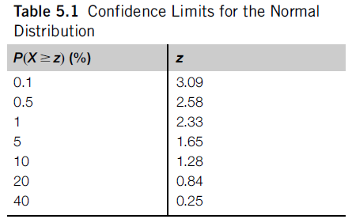

# Week 3: Answering Questions with Statistics and ML

## Weekly Learning Outcomes

1. Apply some basic descriptive statistics (MLO 2)
2. Explain the concepts of classification and regression (MLO 3)
3. Apply linear regression to reasonably clean data (MLO 3)
4. Apply decision trees to reasonably clean data (MLO 3)
5. Evaluate classification and regression models using simple standard metrics (MLO 3)

## Reading for this Week

### Lesson 1

- Read Chapter 2 of Diez et al

### Lesson 2

- Kelleher, section “Supervised versus Unsupervised Learning” in Chapter 4
- Kelleher, Chapter 5, "Standard Data Science Tasks"

### Lesson 3

- Sections 3.0-3.2, and 4.6 from  Witten et al

### Lesson 4

- Section 3.3 and 4.3 from Witten et al
- Kelleher, Section "Decision Trees" in Chapter 4

### Lesson 5

- Witten et al
  - Sections 5.0 to 5.3
  - Section 5.9
  - Section 8.5

Lawts and lawts of reading dude

## Table of Contents

1. [Basic Descriptive Statistics](#lesson-1-basic-descriptive-statistics)
    1. [Plots](#plots)
    2. [Malaria Case Study](#malaria-vaccine-case-study)
2. [Key Concepts in Machine Learning](#lesson-2-key-concepts-in-machine-learning)
    1. [Types of Machine Learning](#types-of-machine-learning)
    2. [A Quick Glossary](#a-quick-glossary)
    3. [Standard Data Science Tasks](#standard-data-science-tasks)
3. [Linear Regression](#lesson-3-linear-regression)
    1. []()
    2. []()
    3. []()
4. [Decision Trees](#lesson-4-decision-trees)
    1. []()
    2. []()
    3. []()
5. [Evaluated Learning Models](#lesson-5-evaluated-learning-models)
    1. []()
    2. []()
    3. []()

## Lesson 1: Basic Descriptive Statistics

A lot of the reading for this, at least to start with, is seriously the basics of descriptive statistics and plotting. To start with, we look at a scatterplot - two continuous variables plotted against each other. Then we define the mean as the sum of the values divided by the number of values: $\frac{\sum_{n}^{i=1}x_i}{n}$ which we all know and love.

Mean is a measure of *central tendency* - the typical or central value of a given dataset. Mean is particularly sensitive to outliers, however. Other measures of central tendency include:

- Median - less sensitive to outliers
- Mode - useful for categorical data
- Mid-range - the mean of the maximum and minimum values. Useful for U-shaped distributions and finding an estimate for maximum

### Plots

Plots are always helpful. They're good for visualising data without transformations and for identifying patterns that may be useful to you, then verifying using statistics. For example, a time series may exhibit seasonality, or a histogram may show a patterned distribution (or not - equally informative). Pie charts can tell us about the distribution of classes in a dataset and bar charts can give us an overview of order.

#### Histograms and Skew

Histograms show a distribution of data points of a variable. The distribution can be skewed left or right. However, it's a little bit backwards in my mind so I'm making a point of it. Skewing left means that a larger proportion of data points fall to the *right* and the data trails off to the left. The opposite is true for right skew.

That is to say that, if you had a lot of people in a company earning around the mean, with one or two earning significantly more than the mean, those individuals would be skewing the data to the right.

#### Skewness and Kurtosis

Skew can be measured statistically! We typically use the following formula to measure the *standard* skewness:

$$\frac{\sum_{i=1}^{n}(Y-\bar{Y})^3/n}{s^3}$$

where $\bar{Y}$ is the mean and $s$ is the standard deviation. A positive value means a right-skew, negative is left-skew and 0 means normal skew.

Kurtosis is a characteristic of a distribution too. This essentially indicates how intense the peak of a curve is, or how closely packed the instances are to the central tendency. Standard normal distribution has a kurtosis of 3. This is characterised with the formula:

$$\frac{\sum_{i=1}^{n}(Y-\bar{Y})^4/n}{s^4}$$

which is the same as skewness, but with a power of 4! These are generalisable to the form

$$\frac{\sum_{i=1}^{n}(Y-\bar{Y})^k/n}{s^k}$$

where different values of k have different meanings. 1 has no statistical meaning, 2 is the *variance* and orders higher than 4 are typically used for specialist statistical models, outside the scope of our learning.

Standard deviation is typically defined as the square root of variance, which is the average square distance from the mean.

#### Box Plots and Robust Statistics

Box plots are nice and simple. We take the median (50%), lower quartile (25%) and upper quartile (75%) and draw a box between them all. This is your box plot. The range between the quartiles is known as the interquartile range (IQR). Typically, whiskers are drawn at either end to encompass values outside of the box, but fall outside by up to $1.5\times IQR$. Anything that falls outside of these whiskers is typically assumed to be an outlier.

This makes box plots a really robust way of checking for any outliers in your data. Speaking of robust, statistical measures can be robust or not.

A statistical measure is robust if it is not affected much by the effects of outliers. The median is robust. For example, if you have three points {0, 1, 28}. The median is 1. If you then replace the 28 point with 128, the median is still 1. However, the mean changes from 14.5 to 64.5. Crazy.

We also have a brief look at hypothesis testing (statistical inference). Using a case study of malaria vaccinations, we can determine whether the vaccine is statistically proven to be useful in protecting against malaria.

### Malaria Vaccine Case Study

In this case study, 20 patients were randomly assigned a group - vaccine or control. Let's say 14 were given the vaccine and 6 were given the placebo. After 19 weeks, each patient was given a strain of drug-sensitive malaria and their symptoms were captured

5/14 vaccinated became infected and 6/6 placebo were infected (35.7% vs 100%). This is a large difference, so at first glance, we can see that the vaccine has a large effect on the rate of infection. However, the sample size is small, meaning there is high susceptibility to random fluctuations. So, how do we know this isn't due to random chance and that the rate of infection is actually independent of the vaccine?

We have two possible hypotheses to test here - $H_0$, the assumption that rate of infection is independent of vaccination and $H_A$, the alternative hypothesis.

The difference between the two outcomes (100% - 35.7% = 64.3%) is large. But how large? If we were to simulate this experiment again, but assuming the null hypothesis $H_0$ to be correct, we would expect the range of differences to fall within a standard, Gaussian distribution (i.e. mean of 0, standard deviation of 1). [We can build a histogram](/histo.py) of this:


It's been normalised to the range -100 to 100, but we can see that in actual fact, the 64.3% difference is actually pretty rare (falls into the 98th percentile)

Typically, in statistics, we can accept the alternative hypothesis if we're at least 95% certain that the effect we're seeing is not down to chance (5% chance that it's random). We take this to be the p-value. Since the difference of values is pretty rare compared with a normal distribution (this is an assumption we have to make), we can say that the vaccine has had an effect on the rate of infection.

## Lesson 2: Key Concepts in Machine Learning

> Machine Learning is the study of algorithms that learn drom data to make predictions or decisions without being explicitly programmed

I'm genuinely so bored of seeing different modules go over machine learning again and again.

### Types of Machine Learning

#### Supervised Learning

A set of labelled training examples is used to learn a particular relationship between the features in the data and the classified labels. These are more often than not a classification algorithm

#### Unsupervised Learning

A set of unlabelled data is provided to the agent. The agent then attempts to generate labels for the instances in the data. A typical implementation of this is clustering algorithms, which group instances based on a certain set of characteristics

#### Reinforcement Learning

Here, the environment is the teacher. The agent is placed in an environment, with a specific set of inputs and, over time, learns which actions provide the highest reward. These algorithms are often used in games, but can be applied to a huge range of other scenarios

### A Quick Glossary

When using machine learning, we'll be faced with a few simple, but important, terms:

- Training and Test Data
  - As the name implies, data are split into the training set and test set.
  - You can choose the proportions that split them
  - The model learns the training data and is tested on the test data
- Accuracy
  - A model may learn to predict the label of an instance correctly or incorrectly
  - Training data accuracy is used to know when to stop training, in some cases
  - More useful is the test data accuracy. Since the test data is unseen, seeing how well the model performs here is important
- Model Overfitting
  - When a model learns how to predict the label from the training data a little too well, it will also learn about the quirks and noise and outliers involved
  - It may perform well on the training data, but not on the test data
- Recall and Precision
  - Depending on the business requirements of the data, accuracy may not be enough.
  - In the case of fraudulent transactions, the vast majority (99%+) won't be fraudulent
  - When the model is trained and tested, it may appear to perform exceptionally because it's guessed that no transactions are fraudulent
    - Not helpful since it's missed the <1% of transactions that are
  - Introducing Recall and Precision
  - Precision is the proportion of all positives that were correctly labelled as true positives
    - $$\frac{TP}{TP+FP}$$
    - Useful when false positives are more costly than false negatives
    - e.g. In medical practice, a false diagnosis of a disease can be particularly costly
  - Recall is the ability of a model to find all positive instances
    - $$\frac{TP}{TP+FN}$$
    - Useful when false negatives are more costly than false positives
    - In the case of transaction fraud, a false negative (i.e. identified as not-fraudulent when it is) is more costly than calling an innocent a fraud.
  - Concept Drift
    - Things change. All the time. Because of that, our models need to change. All the time.
    - If you don't update your models when fraud tactics change, or the housing market changes, or leadership changes, you'll fall behind and your models won't be accurate
    - Keep them updated and your knowledge will stay updated

### Standard Data Science Tasks

One of the primary abilities of a data scientist is to frame a real-world problem as a data science task. There are typically four classes of task:

- Clustering
  - Characterised by questions like *"Who are our customers?"*
  - K-means clustering algorithm and its derivatives
- Anomaly Detection
  - Characterised by quetions like *"Was that a fraudster?"*
  - Can be done using one-class classification (with a support vector machine) or clustering algorithms. Essentially, we're measuring dissimilarity, either way.
- Association Rule Mining
  - Characterised by questions like *"Would you like fries with that?"*
  - Used in market-basket analysis - the identification of sets of products that are often bought together
  - This focuses on the relationships between features rather than the instances in a dataset
  - The Apriori algorithm
    - Find all combinations of items with a minimum frequency
    - Generate rules that express the probable co-occurrence of the items in the frequent itemsets.
  - If this then that logic, implication
  - Support and confidence are important measures of rules
- Prediction
  - Classification
    - Characterised by questions like *"To churn or not to churn, that is the question"*
  - Regression
    - Characterised by questions like *"How much will that cost tomorrow?"*

## Lesson 3: Linear Regression

Linear regression, the big misnomer of data science. Linear regression is used as a predictor in continuous variables. We can use this to test the linearity of a relationship between two continuous variables. For example, the height and weight of a population of individuals can be modelled using a linear regression.

This is one of the major assumptions it operates under: **linearity**. When we're looking for relationships between two variables, we have to assume that the relationship is linear. If the relationship is exponential, the linear model will not be particularly good at finding a relationship between your variables.

We can also have linear regression between multiple explanatory variables, increasing the dimensionality of the regression. Linear regression is a special case of the more general GLM (Generalised Linear Model), which can be formulated as:

$$x=w_0+\sum_{i=1}^{k}w_ia_i$$

Where $x$ is the class, $a_i$ is an attribute value and $w_i$ is an attribute's weight. This is a linear function. The weights are calculated from training data.

The goal for training the model is to minimise the sum of the squares of the differences between the predicted and actual values of the data. This is known as the least-squares linear regression:

$$\sum_{i=1}^{n}(x^{(i)}-\sum_{j=0}^{k}w_ja_j^{(i)})^2$$

### Logistic Regression

The GLM is generalised. Okay, cool. What this means is that we can change it, modify it so that we can make different kinds of predictions. Another common implementation of the GLM is logistic regression. Here, we make the assumption that the classifying attribute is binary - the response variable follows a binomial distribution.

This is probably easiest done in R since it comes pre-packaged for this sort of thing. The code for a GLM that represents a logistic regression is:

```R
model <- glm(continuous_var, binary_var, data=df, family="binomial")
```

The objective here is exactly the same as with linear regression (but with a different, sigmoidal link function instead of a linear function). Instead of finding the best value for a given data point, we aim to classify our data points.

Okay, so there's actually a big difference between the two. Logistic regression obviously doesn't assume a linear relationship between the explanatory variables (unbounded from -inf to +inf) and the response (1 or 0). Instead, it replaces the multiresponse linear regression target ($\text{Pr}[1|a_1,a_2,\dots,a_k]$) with one that can be *accurately* approximated using the linear function:

$$\frac{\log[\text{Pr}[1|a_1,a_2,\dots,a_k]]}{1-\text{Pr}[1|a_1,a_2,\dots,a_k]}$$

This log-probability is no longer constrained to 0 or 1, but to -infinity to +infinity, just like with the original linear regression. This is called the logit transformation. In order to perform the linear regression, a reverse transformation is required to constrain the output to the range [0, 1]. This is the sigmoid function:

$$\frac{1}{1+e^{-w_0-\sum_{i=1}^{k}w_ia_i}}$$

As with linear regression, training is to be done. Instead of using the least-squares method however, the log-likelihood of the model is used. This produces our classification of 1 or 0. The decision boundary for binary classification lies where the prediction probability is 0.5. Because this is a relationship that is linear in the attributes, the boundary between 0 and 1 is a hyperplane - i.e. a line in 2D space, a plane in 3D space, a cube in 4D space, etc.

## Lesson 4: Decision Trees

Skipping this in favour of time. It's week 5 at this point

## Lesson 5: Evaluated Learning Models

When it comes to evaluating learning models, it can be somewhat difficult.

### Training and Testing

If we train a model on our training data, we expect the performance of that model against those data to be pretty excellent. It might not be 100% accurate, but it'll be damn near close to it. The assumption then (albeit incorrect), is that it will perform just as well on data it hasn't seen! This is wrong because it just simply hasn't seen it. Past performance is not an indicator of future performance (thank you Vanguard). In this respect, the performance of the model on training data is not predictively impressive (but it can be used effectively for data cleaning, like in imputation).

To this end, we have a test set, which we leave out from the original dataset. There are a few functions that do random sampling for the training set and testing set. For example, sklearn's `train_test_split()` method is effective at this.

We also split the data into three sets sometimes - training data and test data are normal, then we introduce the validation set. This set is used to train hyperparameters of a trained model - we optimise the model with good training performance so it produces a better testing error.

In some cases, people will prefer to merge the training and test data back together once the error rate is determined. This allows us to use more data for a model that is already acceptable to create a new classifier.

The accuracy of an error estimate can be calculated as follows:

$$$$

### Confidence intervals and Bernoulli trials

In statistics, a Bernoulli Process is a series of independent events that either succeed or fail. In the context of a coin toss, each toss is an event where a success is heads or tails (whichever we predict). Let's say the coin is biased, but we don't know what the probability of heads is. If we flip the coin 100 times and 75 of them are heads, we can say that the success rate is around 75%. Same goes for 750 heads out of 1000 tosses. But what exactly is the true success rate?

We can never know exactly. But we can say with a certain amount of confidence that it falls within a certain range (the confidence interval). In the case of the 1000 flips, we can say with 80% confidence that the success rate falls between 73.2% and 76.7%. On the other hand, in the 100 flips version, with 80% confidence, the confidence interval widens to between 69.1% and 80.1%. That margin of error is much larger.

A useful equation for quick reference:

$$\text{Observed Success Rate: }f=S/N\\\text{where}\\S=\text{No. of successes and }N=\text{No. of trials}$$

If the true success rate of a Bernoulli process is $p$ and the mean and variance of that Bernoulli process are $p$ and $p(1-p)$ respectively, then, if $N$ trials are taken, the expected success rate is a random variable with the same mean $p$, but with a reduced variance of $p(1-p)/N$.

That is to say, the variance (spread) of the confidence interval is reduced as $N$ grows larger.

Moving on a bit.

The probability that a random variable X, with 0 mean, lies within a certain confidence range of width $2z$ is:

$$P(-z\le X\le z)=c$$

Typically, values of $c$ and corresponding values of $z$ are given in tables. Linear interpolation can be used to find intermediate values.

Conventionally, the probabilities are given as the upper part of the range - i.e. $P(X\ge z)$, the one-tailed probability. If $P(X\ge z)=5\%$, the probability that the random variable $X$ lies outside of the range $z\le X\le z$ is 10%. That is to say, we are 90% confident that it lies within that range.

If we go back to our earlier example where we had $f=S/N$, we take $f$ to be our random variable in place of $X$, which is assumed to be normally distributed. So, how do we transform $f$ to a normal distribution?

Take the mean ($p$) from $f$ and divide by the standard deviation $\sqrt{p(1-p)/N}$ - square root of the variance.

Now we have the following equation:

$$P(-z<\frac{f-p}{\sqrt{p(1-p)/N}}<z)=c$$

Okay, so that's our confidence interval. How about the confidence limits? That's just a quadratic equation where the positive result is our upper limit and the negative is our lower:

$$p=(f+\frac{z^2}{2N}\pm z\sqrt{\frac{f}{N}-\frac{f^2}{N}+\frac{z^2}{4N^2}})\bigg/(1+\frac{z^2}{N})$$

#### Normal Distribution Z-values



The table above is a nice reference for probabilities and their corresponding z-values. However, it's just a reference and doesn't tell us how to calculate anything else.

We can, however, calculate it!

We take the cumulative probability (i.e. $1-P(X\le z)$) and use the inverse Cumulative Distribution Function (CDF) $\Phi^{-1}$ - AKA the quantile function.

$$z=\Phi^{-1}(1-P(X\le z))$$

Cool.

This can be done in Python:

```python
from scipy.stats import norm
z = norm.ppf(0.95)  # ~1.645
```

### Cross-Validation


