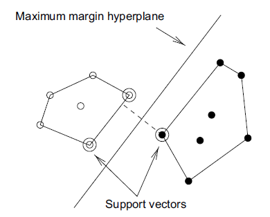
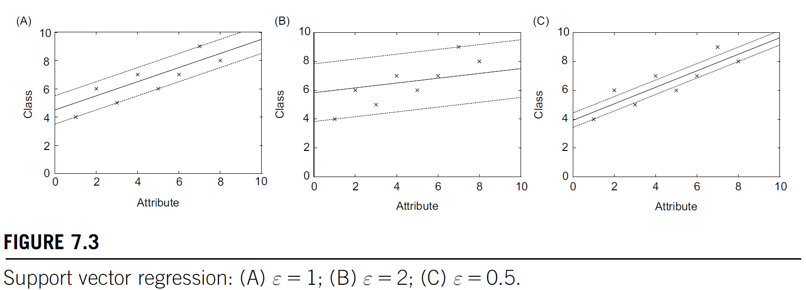

# Week 4: Choosing an Appropriate Analysis Technique

## Weekly Learning Outcomes

1. Apply multiple regression and support vector regression (MLO 3)
2. Apply Naïve Bayes and support vector classification (MLO 3)
3. Choose between techniques for a given analysis in a principled way (MLO 3)
4. Identify, address and document residual threats to validity for a given analysis (MLO 3)

## Reading for this Week

### Lesson 1

- Read Section 7.2 of Witten et al

### Lesson 2

- Section 4.2 of Witten et al

### Lesson 3

- Model Selection Management Systems: The Next Frontier of Advanced Analytics
- Read Sections 5.2 and 5.6 of Witten et al

## Table of Contents

1. [Alternative Techniques for Regression](#alternative-techniques-for-regression)
    1. [Multiple Linear Regression](#multiple-linear-regression)
    2. [Extending the Linear Model](#extending-the-linear-model)
    3. [Support Vector Machines](#support-vector-machines)
    4. [Kernel Ridge Regression](#kernel-ridge-regression)
2. [Alternative Techniques for Classification](#alternative-techniques-for-classification)
    1. [Bayes Theorem](#bayes-theorem)
    2. [Naïve Bayes for Document Classification](#naïve-bayes-for-document-classification)
    3. [Classification in Practice](#classification-in-practice)
3. [Choosing a Learning Technique](#choosing-a-learning-technique)
    1. [Statistical Tests for Choosing a Learning Scheme](#statistical-tests-for-choosing-a-learning-scheme)
    2. []()
    3. []()

## Alternative Techniques for Regression

In order to decide which regression methods are best for our data, we need to be aware of other kinds of regression. Here, I'll talk about a few others like Multiple Linear Regression, Support Vector Regression (or Machine, SVM) and Kernel Ridge Regression.

### Multiple Linear Regression

Okay, so this isn't really extending linear regression much from what I described last week. However, it's the more general form of linear regression. Simple linear regression is characterised by the form

$$y=w_0+w_1x_1$$

or $y=mx+c$. Multiple linear regression is an extension of this into multiple dimensions:

$$y=w_0 + w_1x_1 + w_2x_2 + \dots + w_nx_n$$

The effects are additive! The goal is to minimise the squared error $\sum(y_i-\hat{y}_i)^2$ by estimating the weights $w_0, w_1, \dots, w_n$ that optimise this

The assumptions of linear regression are:

- Linear relationship between inputs and outputs
- Independent input variables
  - Low multicollinearity
- Homoscedasticity
  - Constant variance of errors
- Normally distributed residuals
  - Useful for making statistical inferences about those residuals

#### Multicollinearity

Multicollinearity is a property of attributes such that they are less independent of one another. For example, temperature and pressure are linearly correlated (by a factor of $n\times r\times v^{-1}$). If we measured the effects of temperature and pressure on another feature, they would be difficult to distinguish from one another as drivers of the changes in that feature.

This also leads to unstable coefficients for each of the collinear features and the model may generalise poorly if overfitting occurs because of this.

We can remove correlated features using a Variance Inflation Factor to identify multicollinearity (or if we know which features are likely to be correlated). We can also combine them. For example, instead of using volume and temperature as separate values, we can combine them to create pressure. Another way to manage multicollinearity is to use regularisation. Ridge kernel regression uses this technique to reduce the effects of mullticollinearity.

### Extending the Linear Model

So, while linear regression tools are useful, it's important to recognise that there are times where your real-world data won't be linear (many times, really). Before we get to support vector machines, let's try to extend the linear model that we had before so that we can effectively model nonlinear relationships.

Let's say we have two attributes, $a_1$ and $a_2$. In the multiple linear regression, this would look like:

$$x=w_0 + w_1a_1 + w_2a_2$$

But this doesn't fit the data well! What we can do, however, is transform our inputs by mapping them to a nonlinear space! Now, when we make a straight line in the nonlinear space, it won't look like a straight line in linear space! The decision boundary is no longer a hyperplane!

So, let's apply this idea to the above ordinary linear model. Let's say our original attributes are replaced by a set of attributes giving all products of $n$ factors that can be constructed from those original attributes. For two attributes (as above) with three factors, this would look like:

$$x=w_1a_1^3 + w_2a_1^2a_2 + w_3a_1a_2^2 + w_4a_2^3$$

Now, we can classify our training and test instances by transforming them using the structure above. There is nothing to stop us (in principle) from adding more attributes to this. The problem we come up against, however, is that the number of coefficients to compute explodes as we add more features (problem 1). If we were to add one more attribute (with three factors again) would increase the number of weights from 4 to 10. With 10 attributes with 5 factors, the learning algorithm has to compute over 2000 coefficients. Insane given that linear regression runs in cubic time anyway! Aside from this, the problem comes to be that the data is very likely to be overfit (problem 2).

Support Vector Machines (SVMs) address these two problems

### Support Vector Machines

Let's get into what's known as the *maximum margin hyperplane*.

This is the result of a special kind of linear model. A maximum margin hyperplane is a hyperplane that separates two classes linearly (of course), but it lies equidistant from the convex hulls of the classes' instances. A convex hull is essentially the perimeter of a set of instances. The maximum margin hyperplane is as far as possible from both hulls - it is the perpendicular bisector of the shortest line connecting the hulls.



The instances that are closest to the MMH are called the support vectors. The set of support vectors define, uniquely, the maximum margin hyperplane for the problem.

The hyperplane can be written in the usual form, or it can be written with respect to the support vectors:

$$x=b+\sum_{i}\alpha_i y_i\text{a(i)}\cdot \text{a}$$

Where $y_i$ is the class value of training instance $\text{a(i)}$, while $b$ and $\alpha_i$ are hyperparameters. $\text{a}$ is a test instance and $\text{a(i)}$ is a support vector. The dot product just means $\sum_j a(i)_ja_j$, the sum of the vectors' products.

So, the problem of finding the support vectors, and the values for $b$ and $\alpha_i$ belongs to a class of optimisation problems called constrained quadratic optimisation problems. I'd like to find out how these work.

#### Support Vector Classification

So how does a support vector machine overcome the problems above?

Let's address problem 2 first. When we use the attribute transformation we had before, we tend to overfit because all training instances are used to inform the fit and thus the location of the decision boundary; it's unstable. However, we use the support vectors to train our maximum margin hyperplane, making the decision boundary much more robust (we are using significantly fewer points to make this decision). Overfitting is now less likely to occur!

The problem of computational complexity is still here. Every time a new instance is classified, its dot product has to be calculated with all support vectors, an O(n) action. In the high dimensional mapping, this is hugely expensive!

There is a workaround though. What if we computed the dot products before the nonlinear mapping? This way, we're computing our dot products in the original low-dimensional space, rather than the high dimensional space:

$$x=b+\sum\alpha_iy_i(\text{a(i)}\cdot\text{a})^n$$

where $n$ is the number of factors that we chose in the original high-dimensional mapping. This uses the form $(x\cdot y)^n$, which is called a polynomial kernel. This polynomial kernel can be used as a map to higher dimensionality in a whole bunch of different ways. For example, $(x\cdot y+1)^n$ allows us to include lower-order terms as well. To find a good value of $n$, increment it until the estimated error stops improving.

The type of kernel used opens the door to perceptrons. The radial basis function (RBF) and sigmoid kernels correspond to RBF networks (neural networks, yes!) and multilayer perceptrons with one hidden layer, respectively.

We do, however still need to compute the coefficients for the high dimensional space.

#### Support Vector Regression

Up to this point, we have been using the maximum margin hyperplane to apply to a classification problem. We can also use them for regression problems if we modify them a bit though!

Since the concept of an MMH doesn't exist in regression, we need to find out where to get our support vectors from! This is just like linear regression, really. Let's look at the linear form for simplicity.

The user defines a cutoff, $\epsilon$. The basic idea is to find a function that approximates training points by minimising error. The main difference is that all deviations up to $\epsilon$ are simply discarded. Overfitting risk is minimised by trying to maximise the flatness of the function. The error measure chosen for this is typically the absolute error instead of the squared error.



The $\epsilon$ defines the radius of a tube around the regression function. For linear regression, this tube is a cylinder. If all training points are encapsulated by the tube of width $2\epsilon$, the SVM returns the function in the middle of the tube. The choice for the value of $\epsilon$ is nontrivial. As this value increases, more and more instances are included in the tube and the perceived error reaches zero. In the extreme case, if $2\epsilon$ exceeds the range of class values, the regression line is horizontal and the mean class value is predicted.

When instances fall outside of the tube, they are called support vectors! These are then used to influence the flatness of the tube and almost act like sources of gravity, pulling the tube towards them. The aim of the SVM is to minimise prediction error, but also to maximise tube flatness. When support vectors are involved, the flatness decreases while error also decreases. An upper limit $C$ is placed to restrict the influence of each of the support vectors by limiting the value of $\alpha_i$ in the kernel equation:

$$x=b+\sum\alpha_iy_i(\text{a(i)}\cdot\text{a})^n$$

In contrast to the classification implementation, $\alpha_i$ may be negative.

#### Kernel Ridge Regression

The slight problem with an SVM is that the kernel trick is really elegant, but not anywhere near as simple as the matrix operations we find in classic least-squares linear regression (because they're nonlinear, duh). Kernel Ridge Regression offers an alternative that combines the benefits of both.

Kernel ridge regression doesn't use the user-defined $\epsilon$ that SVR does, which means that we can use the squared error instead of the absolute error like in linear regression. The neat trick here is to express a model's predicted class for a test instance as a weighted sum over the **dot products of each training instance** and the test instance, instead of a weighted sum of attribute values:

$$\sum_{j=1}^n\alpha_j \text{a}_j\cdot \text{a}$$

The overruling assumption here, however, is that the function goes through the origin (has no intercept value). The dot product here can be replaced by a kernel function to yield a nonlinear model, as with SVMs. The loss function that we use here is a little different, though.

The sum of squared errors that we're used to is:

$$\sum_{i=1}^n \bigg(y_i=\sum_{j=1}^n\alpha_j\text{a}_j\cdot\text{a}_i\bigg)^2$$

For which the problem is that we're minimising error by choosing appropriate $\alpha_j$ values. Now, we have a coefficient for each training instance, rather than each attribute, leading to a serious case of overfitting!

This is where the ridge comes in. We now trade closeness of fit (the normal error part) for model complexity by introducing a penalty:

$$\sum_{i=1}^n \bigg(y_i=\sum_{j=1}^n\alpha_j\text{a}_j\cdot\text{a}_i\bigg)^2 + \lambda\sum_{i,j=1}^n\alpha_i\alpha_j\text{a}_j\cdot\text{a}_i$$

Which effectively penalises large coefficients. The $\lambda$ term controls the tradeoff between complexity and model fit. Because the penalty is a simple summative term, it also has the added benefit of stabilising unstable cases (values close to zero, for example).

This just means that no single instance has too large a coefficient placed on it unless it significantly reduces error.

In comparison to standard linear regression, a KRR is simply unfeasible. The matrix operations are the most expensive, being an $O(n^3)$ operation. In the case of linear regression, the matrix is an $n\times n$ matrix of attributes. For KRR, it's an $m\times m$ matrix of *instances*. In a normal dataset, there will be far more instances than attributes, so this is only appropriate for nonlinear relationships or for small datasets.

## Alternative Techniques for Classification

### Bayes Theorem

$$P(A|B)=\frac{P(B|A)\times P(A)}{P(B)}$$

This equation underpins what's known as Bayes Theorem. Essentially, it's a probabilistic equation that tells us what the probability of an event occurring, given that another event has already occurred is.

Let's give an example. Let's say two factories (Factory 1 and Factory 2) produce bottles. F1 produces 240 bottles an hour and F2 produces 160 bottles an hour. Out of these 400 bottles an hour, let's say 10% are defective and that 50% of the defective bottles come from F1 and the other 50% from F2.

If we look at all these bottles, and we know which factory each came from, what is the probability that I pick a defective bottle from F2?

Let's reframe this mathematically:

$$P(F1)=60\%\\ P(F2)=40\%\\ P(defect)=10\%\\ P(F1|defect)=50\%\\P(F2|defect)=50\%$$

What we want to know (what's the probability of a bottle being defective, given that we know it's from F2?) can be written as:

$$P(defect|F2)=\frac{P(F2|defect)\times P(defect)}{P(F2)}$$

which we can calculate as $\frac{0.5\times 0.1}{0.4}=0.125$.

So why is this useful? In classification, we use Bayes theorem as a foundation for the Naïve Bayes algorithm, which essentially looks through the training instances, finds out which characteristics made an instance a member of a class, and calculates the chances that a new instance falls into that class, given that we know attributes of the other members of the class.

So, for the purposes of classification, we're determining the probability of a class based on the probability of each feature:

$$P(class|features)\propto P(class) \cdot P(features|class)$$

Now, we're looking at a proportionality here. This is because the way our probabilities are determined is dependent on the distribution function of the features. A Naïve Bayes classifier makes assumptions about the distribution of features. There are Gaussian (normal), multinomial and Bernoulli (binary) distributions for example.

The Naïve Bayes classifier makes the assumption that your features are measured independently of each other. So, looking at this a bit more generally, we can hypothetically mix our data types but it's not exactly a great idea.

Also, let's remember how we formulate the $P(features|class)$ term:

$$P(features|class) = \prod_{i=1}^nP(feature_i|class)$$

Naturally, we can see how this assumes that our features are measured independently.

The problem we now come up against is that probabilities based on zero occurrences will equal zero. Obviously anything multiplied by zero is zero, no matter what other values were involved. Not good. We can either use a Laplace estimator to change zero probabilities to nonzero.

The same problem doesn't occur when an attribute is *missing*. The likelihood is simply ignored, rather than zero.

Ooh, while I'm here let's look at those probability functions!

Gaussian is formidable but here it is:

$$f(x)=\frac{1}{\sqrt{2\pi\sigma}}e^{-\frac{(x-\mu)^2}{2\sigma^2}}$$

Which is to say that the probability density of a continuous variable taking a specific value can be calculated through this. Probability density? I thought we were finding the probability! Yes and no. The density is similar but not quite the same. It's more that this is the probability that a value falls within the range $x\pm\epsilon$. The probability is therefore $\epsilon\cdot f(x)=\frac{1}{\sqrt{2\pi\sigma}}e^{-\frac{(x-\mu)^2}{2\sigma^2}}$. This sounds like a drawback since you'd have to choose an epsilon value for every probability, but the way it all shakes out with normalisation is that you don't have to do this - the epsilons end up cancelling each other out.

So now we have this probability distribution, we can use it in our calculations of the posterior probability

### Naïve Bayes for Document Classification

So, now that we've gone over Bayes Theorem and how probabilities are calculated, let's apply this to a classification problem: document classification.

Let's say we have a news website. Each article fits into a category of some sort (world news, politics, sports, weather, etc.). Naïve Bayes as we laid out above is good at this sort of problem.

We can look at a document as an instance where all of its attributes are the words that comprise it, as Boolean values - yes or no.

This isn't particularly helpful when it comes to document classification, however, since words can appear more than once, and the frequency may be useful in determining what type of document it is. Now, we use a different version of the Naïve Bayes classification scheme - multinomial Naïve Bayes.

Suppose $n_1, n_2, \dots, n_k$ is the number of times word $i$ appears in a document and $P_i$ is its corresponding probability. In multinomial Naïve Bayes, the distribution of words is assumed to follow a multinomial distribution (in the same way that the Gaussian Naïve Bayes followed normal distribution).

There are two formulae for the multinomial Naïve Bayes classification scheme. First, I'll show the one from the textbook and the theory behind that.

#### Exact Multinomial Probability

The textbook describes a document as a bag of words - the frequency of words is important but the order they appear is not. $P_i$ is the probability of obtaining word $i$ when sampling from all documents in a hypothetical category $H$. For the multinomial distribution, the probability of a document (or event) $E$ given its class $H$ is:

$$P(E\mid H)=N!\times\prod_{i=1}^k\frac{P_i^{n_i}}{n_i!}$$

where $N$ is the total number of words in a document. Here, $P_i$ is estimated as the relative frequency of word $i$ in all training documents in class $H$.

Typically, because, for large documents, the probabilities can become very small, underflow can occur. This problem is typically avoided by taking the logarithm of probabilities to stabilise the calculation.

In practice, the factorials are not calculated because they are cancelled out in the normalisation process.

#### Estimating the Probabilities

Including all of these factorials and products can be computationally expensive, especially when taking the logarithm is computed at the end of it all. Usually, multinomial Naïve Bayes implements a different, less computationally expensive estimation of the probabilities of a word $P(w_i\mid C)$. We use Laplace smoothing.

The decision rule is as follows:

$$C=\argmax_C\bigg[\log P(C) + \sum_{i=1}^n x_i\log P(w_i\mid C)\bigg]$$

Where the probability of a word given its class is estimated as:

$$P(w_i\mid C)=\frac{N_{w_{i},C}+1}{\sum_j N_{w_{j}, C} + V}$$

Where $N_{{w_i}, C}$ is the frequency of word $w_i$ in class $C$ and $V$ is the total number of words in the data

What this aims to do is to replace any chance of a zero probability occurring. Let's say we have two classes - A and B. Our vocabulary consists of two words: "sunny" and "rainy". Our training data are

```powershell
Class A: ["sunny", "sunny", "rainy"]
Class B: ["rainy", "rainy", "rainy"]
```

We know that, from training:

```powershell
Class A
  P(sunny | A) = 2/3
  P(rainy | A) = 1/3

Class B
  P(sunny | B) = 0/3
  P(rainy | B) = 3/3
```

Let's say we have a test document ["sunny", "rainy"]. Let's compare the full multinomial probability with estimating using Laplace Smoothing.

$$P(E\mid H) = N!\cdot\prod_{i=1}^k \frac{P_n^{n_i}}{n_i!}$$

Substitute our test document:

$$P(test | A) = 2!\cdot\bigg(2/3\cdot1/3\bigg) = 2\cdot\frac{2}{9} \approx 0.444\\P(test | B) = 2!\cdot\bigg(0\cdot 1\bigg) = 0$$

And that's a zero probability! Not good! Compare with Laplace Smoothing:

$$P(w_i\mid C)=\frac{N_{w_{i},C}+1}{\sum_j N_{w_{j}, C} + V}$$

The probabilities of the words become

```powershell
Class A
  sunny = 3/5
  rainy = 2/5
Class B
  sunny = 1/5
  rainy = 4/5
```

Plugging this in to our simplified Naïve Bayes

$$P(E\mid H) = P(E) \prod P(w_i\mid E)^{n_i}$$

Assuming uniform priors $P(A) = P(B)$

$$P(A\mid ["sunny", "rainy"])=0.5\cdot \frac{3}{5}\cdot \frac{2}{5} = 0.12\\
P(B\mid ["sunny", "rainy"])=0.5\cdot \frac{1}{5}\cdot \frac{4}{5}=0.08$$

Looking at both, we can say that this document should be classified as class A, but the probabilities are different for each method.

### Classification in Practice

Have a look at [classification.py](classification.py) to take a look at how the support vector machine (described in lesson 1) compares with Naïve Bayes and the Decision Tree classifier which I should have covered last week :/ Confusion matrices are useful for determining the accuracy (and precision and recall) of classifiers. I've used both the iris and wine datasets to show these

## Choosing a Learning Technique

How do we choose a technique for analysing our data? There's a simple three-step process for figuring this out.

1. Identify qualitatively appropriate techniques
    1. Which approaches make sense for the question at hand?
2. Quantitative performance
    1. Drawing on experience and prior knowledge to see which techniques are particularly useful for answering this question
    2. The right tool for the right job
    3. This considers the practical limitations of techniques - computational complexity, interpretability, outlier sensitivity etc.
3. Empirical Testing
    1. If all candidates seem appropriate, just start testing to see which performs the best and is most appropriate for your data in practice

### Statistical tests for choosing a learning scheme

T-tests are effective for showing if there is a significant difference between two models' performances. In fact, we're finding out if there is a significant difference between the residuals of our models
